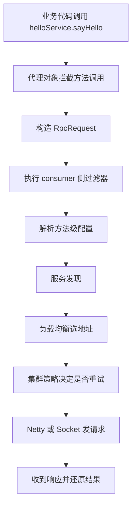

# consumer 调用链小白版

## 1. 先说结论

consumer 侧最核心的事情只有一句：

`把一次本地方法调用，包装成一次远程请求，并把结果再还原回来。`

## 2. 从你能看见的代码开始

你写的是：

```java
helloService.sayHello("consumer")
```

你以为自己在调用本地对象。

其实你拿到的是一个代理对象。

## 3. consumer 侧完整流程图



## 4. 每一步到底在干什么

### 4.1 代理对象拦截

作用：
1. 不让业务代码直接感知远程调用细节
2. 把方法调用转成框架能理解的数据

没有这层，你就得自己手写请求对象。

### 4.2 构造 `RpcRequest`

作用：
1. 把服务名、方法名、参数类型、参数值打包起来
2. 让这次调用可以跨网络传输

### 4.3 过滤器链

作用：
1. 做 trace、日志、指标这类横切逻辑
2. 不污染业务代码

### 4.4 方法级配置

作用：
1. 不同方法可以有不同超时
2. 不同方法可以有不同重试策略
3. 不同方法可以有不同负载均衡策略

### 4.5 服务发现

作用：
1. 告诉 consumer 这个服务现在在哪些地址上可用

### 4.6 负载均衡

作用：
1. 有多个 provider 时，选一个目标实例

### 4.7 集群策略

作用：
1. 决定失败后是直接报错
2. 还是切换实例重试

### 4.8 传输层

作用：
1. 把请求真正发出去
2. 把响应真正收回来

## 5. 这条链最重要的几个类

第一遍只要先记住：
1. `RpcProxyFactory`
2. `RpcInvocationHandler`
3. `RpcClientInvocationExecutor`
4. `RpcServiceResolver`
5. `RpcNettyClient`

## 6. 用一句话记住 consumer 侧

`consumer 侧做的不是业务，而是把一次本地调用组织成一次可治理、可传输、可恢复结果的远程调用。`
