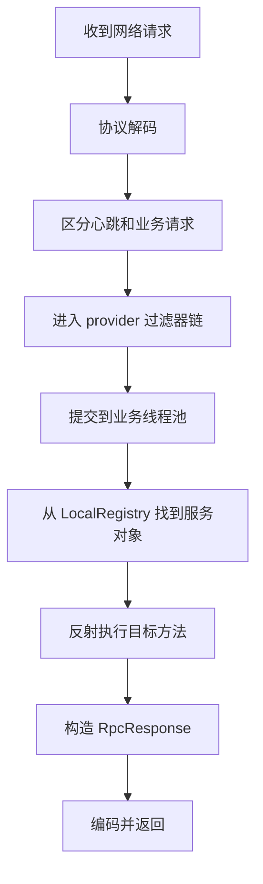

# provider 调用链小白版

## 1. 先说结论

provider 侧最核心的事情只有一句：

`把收到的远程请求，交给真正的本地服务对象去执行。`

## 2. provider 侧流程图

## 3. 为什么 provider 端不能简单理解成“收到就执行”

因为中间还要处理很多事情：
1. 消息是不是合法
2. 是心跳还是业务请求
3. 当前服务端是否允许接收新请求
4. 是否要限流
5. 业务执行不能阻塞网络线程

## 4. 每一步在干什么

### 4.1 协议解码

把网络字节流还原成框架里的消息对象。

### 4.2 分发器

先判断：
1. 是心跳请求
2. 还是正常业务请求

### 4.3 provider 过滤器

做的通常是：
1. 限流
2. 指标统计
3. 日志上下文恢复

### 4.4 业务线程池

作用：
1. 不让慢业务阻塞 IO 线程
2. 给服务端做资源隔离

### 4.5 `LocalRegistry`

作用：
1. 根据 `serviceName` 找到 JVM 里的真实服务对象

### 4.6 反射执行

作用：
1. 根据方法名和参数类型找到真正的方法
2. 调用 `HelloServiceImpl.sayHello(...)`

## 5. 这条链最重要的几个类

第一遍只要先记住：
1. `RpcNettyServer`
2. `RpcRequestDispatcher`
3. `RpcRequestExecutor`
4. `LocalRegistryImpl`
5. `HelloServiceImpl`

## 6. 用一句话记住 provider 侧

`provider 侧的核心任务，是把远程请求安全地落到本地服务实例上执行。`
