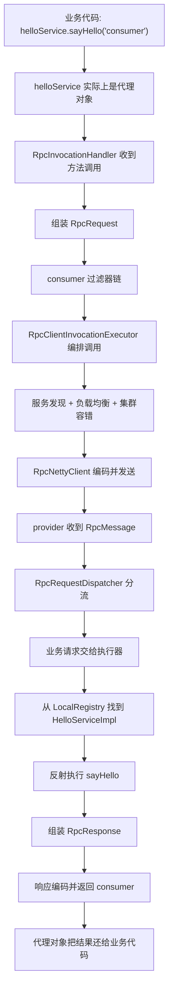

# 一次 RPC 调用的完整鸟瞰图

## 1. 这一篇的任务是什么

这一篇不是为了把所有源码细节一次讲完。

这一篇只做一件事：

`先把一次 RPC 调用从业务代码到远程执行，再到结果返回的完整故事讲清楚。`

如果这个故事你没有真正建立起来，后面看任何源码都会有三个典型问题：

1. 看到类很多，但不知道它们为什么存在
2. 看到分层很多，但不知道这一层夹在谁和谁之间
3. 看到方法很多，但不知道当前代码属于整条链路的哪一段

所以这篇是整个主线课程的总地图。

后面每一篇都只是把这条主线放大来看：

- `02-consumer-side-deep-dive.md`：只看 consumer 端怎么把本地调用变成远程调用
- `03-provider-side-deep-dive.md`：只看 provider 端怎么把远程请求变成真实方法执行
- `04-spring-integration-story.md`：只看 Spring 是怎么把这些东西接进容器生命周期的
- `05-config-extension-resilience.md`：只看配置、SPI 扩展和治理能力怎么插进调用链
- `06-protocol-and-transport-story.md`：只看协议和网络传输怎么把请求真正发出去

你可以把这一篇理解成：

`先把整部电影的剧情看明白，再去拆每一幕。`

---

## 2. 先看最熟悉的一行业务代码

当前项目里，最值得反复盯住的代码不是框架代码，而是业务代码里的这一句：

```java
System.out.println(helloService.sayHello("consumer"));
```

它来自 consumer 示例应用：

```java
@SpringBootApplication
public class ExampleConsumerApplication {
    public static void main(String[] args) {
        SpringApplication.run(ExampleConsumerApplication.class, args);
    }

    @Component
    static class ConsumerRunner implements ApplicationRunner {
        @RpcReference
        private HelloService helloService;

        @Override
        public void run(ApplicationArguments args) {
            System.out.println(helloService.sayHello("consumer"));
            System.out.println("1 + 2 = " + helloService.add(1, 2));
        }
    }
}
```

源码位置：
- `example-consumer/src/main/java/com/rpc/ExampleConsumerApplication.java`

如果你只看这段业务代码，你会天然觉得：

1. `helloService` 应该是一个普通对象
2. `sayHello("consumer")` 应该是一次普通 Java 方法调用
3. 调用以后马上拿到返回值

但在 RPC 项目里，这三个感觉只有表面是对的。

真正发生的是：

1. `helloService` 并不是 provider 端真实实现类
2. 它大概率只是一个代理对象
3. 代理对象会把这次方法调用翻译成请求对象
4. 请求对象会经过配置、过滤器、服务发现、负载均衡、集群容错
5. 最终它会被编码并通过网络发送到远端机器
6. 远端机器再把它还原成一次真实方法执行

也就是说，业务代码看到的是“本地方法调用的外观”，框架内部做的是“远程调用的真实流程”。

这正是 RPC 的核心价值。

---

## 3. provider 端最终到底执行谁

consumer 端调用的是接口：

```java
public interface HelloService {
    String sayHello(String name);

    String sayHi(String name);

    Integer add(Integer a, Integer b);
}
```

源码位置：
- `example-api/src/main/java/com/rpc/HelloService.java`

provider 端提供的是实现类：

```java
@RpcService(HelloService.class)
public class HelloServiceImpl implements HelloService {
    @Override
    public String sayHello(String name) {
        return "Hello, " + name + "!";
    }

    @Override
    public String sayHi(String name) {
        return "Hi, " + name + "! Nice to meet you!";
    }

    @Override
    public Integer add(Integer a, Integer b) {
        return a + b;
    }
}
```

源码位置：
- `example-provider/src/main/java/com/rpc/HelloServiceImpl.java`

这个实现类很普通，普通到你几乎感受不到“RPC 的存在”。

这其实是好事。

因为 RPC 框架的目标之一，就是让服务提供者写业务时尽量像写本地代码一样简单。框架复杂度应该尽量被关在框架内部，而不是蔓延到业务实现里。

你先记住一个最重要的事实：

`consumer 调的是接口，provider 真正执行的是接口实现类。`

接口是双方的契约，实现类只存在于 provider 端。

---

## 4. 用一句人话先概括整条链

你可以先把这条主线压缩成一句话：

`consumer 把一次本地接口调用伪装成远程请求发出去，provider 再把远程请求还原成一次本地方法执行。`

如果展开一点，就是：

```text
业务代码调用 helloService.sayHello(...)
  -> 实际调用到代理对象
  -> 代理对象生成 RpcRequest
  -> consumer 侧根据配置组织这次调用
  -> 通过服务发现拿到 provider 地址
  -> 经过负载均衡和容错策略决定这次发给谁
  -> 请求被编码成协议消息
  -> 请求通过网络发送到 provider
  -> provider 解码出 RpcRequest
  -> provider 判断这是心跳还是业务请求
  -> provider 找到本地注册表里的服务实现
  -> 反射调用 HelloServiceImpl.sayHello(...)
  -> 返回结果包装为 RpcResponse
  -> 响应编码后经网络返回 consumer
  -> consumer 解码响应并把结果交还业务代码
```

这就是全项目最核心的骨架。

---

## 5. 先看一张“完整流程总图”



这张图现在不用要求自己一次记住所有类名。

你只要先记住三段就够了：

1. consumer 入口：从本地方法调用进入代理
2. 中间链路：把请求组织好并发出去
3. provider 处理：把请求还原成真实业务执行

后面主线课程本质上就是把这三段逐步放大。

---

## 6. 第一个误区：业务代码拿到的并不是实现类

很多刚接触 RPC 的人会不自觉地把下面两件事混在一起：

1. `HelloService` 这个接口
2. `HelloServiceImpl` 这个实现类

在本地单体项目里，接口和实现类通常都在同一个进程里，Spring 直接注入实现类对象或者代理对象，大家不会觉得奇怪。

但在这个 RPC 项目里，consumer 和 provider 是两个独立应用。

consumer 端只有接口契约，不应该依赖 provider 的实现类。

所以 consumer 端拿到的 `helloService` 不可能是 `HelloServiceImpl`。它只能是一个代理对象，这个代理对象的职责就是：

- 接收方法调用
- 收集服务名、方法名、参数、返回值类型
- 生成 `RpcRequest`
- 调用底层传输能力拿到 `RpcResponse`
- 把结果再返回给业务代码

所以当你后面看到 `RpcProxyFactory`、`RpcInvocationHandler` 的时候，不要把它们理解成“附加功能”，它们其实是 consumer 端的第一道大门。

---

## 7. 第二个误区：网络发送并不是代理层自己完成的

很多新手看到代理就会下意识认为：

`代理对象收到方法调用以后，应该自己直接把请求发出去。`

但当前项目没有这么写。

它做了分层：

- 代理层只负责把“方法调用”翻译成“请求对象”
- 调用执行器负责把一次请求组织完整
- 服务解析器负责挑选目标地址
- transport 层负责真正发请求
- protocol 层负责把对象变成字节

为什么要这样拆？

因为如果代理层自己把所有事都做完，那它会同时承担：

1. 代理职责
2. 配置解析职责
3. 服务发现职责
4. 容错职责
5. 协议职责
6. 网络职责

这会让代理层变成一个巨大的“全能类”，后面所有扩展都会非常难做。

所以这个项目的一个很重要设计点是：

`入口可以简单，但内部职责不能混。`

---

## 8. consumer 启动时，框架先做了哪些准备

虽然业务代码只写了 `@RpcReference`，但框架在启动时做了很多准备工作。

以 consumer 侧为例，`RpcConsumerBootstrap.fromConfig(...)` 会做这些事：

```java
public static RpcConsumerBootstrap fromConfig(RpcFrameworkConfig frameworkConfig) {
    DegradationPolicy degradationPolicy = DegradationPolicyFactory.create(
            frameworkConfig.getConsumerDegradationPolicy(),
            frameworkConfig.getConsumerDegradationDefaultValues()
    );
    FilterManager.configure(frameworkConfig);
    FilterRuntimeConfigurator.configureConsumer(frameworkConfig, degradationPolicy);

    ServiceDiscovery serviceDiscovery = ServiceRegistryFactory.createDiscovery(frameworkConfig);
    RpcClientConfig clientConfig = RpcClientConfig.builder()
            .transportType(frameworkConfig.getTransportType())
            .connectTimeout(frameworkConfig.getConnectTimeout())
            .readTimeout(frameworkConfig.getReadTimeout())
            .heartbeatInterval(frameworkConfig.getHeartbeatInterval())
            .retryTimes(frameworkConfig.getRetryTimes())
            .clusterStrategy(frameworkConfig.getClusterStrategy())
            .methodConfigs(frameworkConfig.getMethodConfigs())
            .loadBalancer(LoadBalancerFactory.getLoadBalancer(frameworkConfig.getLoadBalancer()))
            .serializerName(frameworkConfig.getSerializer())
            .build();

    RpcTransport rpcTransport = RpcTransportFactory.create(clientConfig, serviceDiscovery);
    return new RpcConsumerBootstrap(serviceDiscovery, rpcTransport);
}
```

这段代码说明了一个关键事实：

consumer 启动时不是只创建了一个“客户端连接”，而是把整套调用基础设施都组装起来了。

这里至少包括：

- 服务发现
- 负载均衡
- 传输层
- 过滤器
- 方法级配置
- 降级策略
- 重试和集群策略的输入参数

也就是说，后面业务代码看起来简单，是因为启动阶段已经把很多零件提前装好了。

---

## 9. provider 启动时，框架先做了哪些准备

provider 端对应的启动器是 `RpcProviderBootstrap`。

它的职责和 consumer 不一样。consumer 的重点是“怎么调用别人”，provider 的重点是“怎么把自己暴露出去”。

核心代码如下：

```java
public static RpcProviderBootstrap fromConfig(RpcFrameworkConfig frameworkConfig) {
    DegradationPolicy degradationPolicy = DegradationPolicyFactory.create(
            frameworkConfig.getServerDegradationPolicy(),
            frameworkConfig.getServerDegradationDefaultValues()
    );
    FilterManager.configure(frameworkConfig);
    FilterRuntimeConfigurator.configureProvider(frameworkConfig, degradationPolicy);

    ServiceRegistry serviceRegistry = ServiceRegistryFactory.create(frameworkConfig);
    RpcServerConfig serverConfig = RpcServerConfig.custom()
            .transportType(frameworkConfig.getTransportType())
            .host(frameworkConfig.getServerHost())
            .port(frameworkConfig.getServerPort())
            .bossThreads(frameworkConfig.getBossThreads())
            .workerThreads(frameworkConfig.getWorkerThreads())
            .build();
    RpcServer rpcServer = RpcServerFactory.create(serverConfig, serviceRegistry);
    return new RpcProviderBootstrap(serviceRegistry, rpcServer, frameworkConfig);
}
```

然后在服务注册时：

```java
public RpcProviderBootstrap registerService(Class<?> serviceInterface, Object serviceImpl) {
    rpcServer.getLocalRegistry().register(serviceInterface.getName(), serviceImpl);
    return this;
}
```

这说明 provider 端至少干了两类准备：

1. 组装服务端基础设施
2. 把服务接口和实现类注册到本地注册表里

为什么一定要有本地注册表？

因为 provider 收到的只是一个请求对象，请求对象里只有：

- 服务名
- 方法名
- 参数类型
- 参数值

它必须根据这些信息先找到“本地到底该调用谁”，这个映射关系就是本地注册表提供的。

---

## 10. 把整条链先切成三段来看

为了后面阅读不乱，你可以把全链路只分成三段。

### 第一段：consumer 入口段

这一段做的事是：

`把本地方法调用翻译成一份完整的远程调用请求。`

核心类通常包括：

- `RpcSpringManager`
- `RpcConsumerBootstrap`
- `RpcProxyFactory`
- `RpcInvocationHandler`

### 第二段：调用编排和传输段

这一段做的事是：

`决定这次要调谁、按什么策略调、用什么序列化方式调、再通过网络把它发出去。`

核心类通常包括：

- `RpcClientInvocationExecutor`
- `RpcServiceResolver`
- `RpcNettyClient`
- `RpcProtocolEncoder`
- `RpcProtocolDecoder`

### 第三段：provider 处理段

这一段做的事是：

`收到远程请求后，把它还原成一次本地方法执行，并生成响应。`

核心类通常包括：

- `RpcProviderBootstrap`
- `RpcRequestDispatcher`
- `RpcRequestExecutor`
- `LocalRegistry`
- 具体业务实现类，如 `HelloServiceImpl`

只要你先把所有类归到这三段里，阅读难度就会明显下降。

---

## 11. 站在“消息形态”的角度再看一次

刚才我们是站在“调用故事”的角度看。

现在再换一个角度：站在“数据形态变化”的角度看。

一次调用中，数据大致经历了这些变化：

```text
Java 方法调用
-> RpcRequest 对象
-> RpcMessage（带协议头和消息体）
-> 字节流
-> 网络传输
-> 字节流
-> RpcMessage
-> RpcRequest
-> Java 方法调用
-> RpcResponse
-> RpcMessage
-> 字节流
-> RpcMessage
-> RpcResponse
-> Java 返回值
```

这条“形态变化链”很重要。

因为它能帮你理解为什么项目里要分出这些层：

- 代理层关心“方法调用”
- 协议层关心“消息对象”
- 编解码层关心“字节流”
- 传输层关心“网络发送和接收”
- provider 执行层再把它变回“方法调用”

这不是为了设计得漂亮，而是因为不同阶段处理的对象本来就不一样。

---

## 12. 为什么这个项目要同时有注册中心和本地注册表

这个问题很容易混。

很多人第一次看会问：

`既然已经有注册中心了，为什么 provider 端还要有 LocalRegistry？`

答案是：这两个东西解决的不是同一个问题。

### 注册中心解决的是“consumer 去哪里找 provider”

注册中心保存的是服务地址信息，比如：

- 某个服务接口由哪些 provider 实例提供
- 每个实例的 host/port 是什么

### 本地注册表解决的是“provider 收到请求后到底调用哪个对象”

provider 收到请求以后，已经知道请求到自己这里了。

但它还需要继续知道：

- `serviceName=xxx` 对应哪个本地对象
- `methodName=yyy` 应该反射调哪个方法

所以这两个注册并不冲突：

- 注册中心是“远程寻址”
- 本地注册表是“本地分发”

这个区分一旦弄清楚，你对 provider 侧很多代码都会更顺。

---

## 13. 为什么要有过滤器链

在 `RpcInvocationHandler` 里，你会看到 consumer 侧先经过过滤器链：

```java
RpcResponse response = (RpcResponse) new DefaultFilterChain(
        FilterManager.getFilters(FilterPhase.CONSUMER),
        filterContext -> client.sendRequest(filterContext.getRequest())
).proceed(context);
```

在 `RpcClientInvocationExecutor` 里，你会看到 invoker 阶段还有一层过滤器链：

```java
return (RpcResponse) new DefaultFilterChain(
        FilterManager.getFilters(FilterPhase.INVOKER),
        filterContext -> invokeWithCluster(filterContext.getRequest(), transportInvoker, options)
).proceed(context);
```

这说明项目不是只允许“一条固定调用链”，而是特意在链路中预留了“可插入点”。

这样做的好处是：

- 统计逻辑可以插进去
- 日志逻辑可以插进去
- 鉴权逻辑可以插进去
- 限流、熔断、降级逻辑可以插进去
- 不需要把这些横切逻辑硬塞到代理类或者网络类里

对于小白来说，你先不要把过滤器理解成复杂模式。

你只要把它理解成：

`在主流程关键位置预留出的可插拔扩展点。`

---

## 14. 为什么要有调用执行器

`RpcClientInvocationExecutor` 这个类对第一次看源码的人通常比较陌生。

因为它不像“代理”“注册中心”“Netty”这种名词那样直观。

但它其实是 consumer 端非常关键的编排中心。

它的工作不是单纯发请求，而是把这些事情统筹起来：

- 方法级配置解析
- 限流
- 熔断器
- 负载均衡
- 集群容错
- 重试
- 最终调用 transport

为什么要单独有这样一个类？

因为“发请求”并不是一个简单动作。

真正的一次远程调用，其实是一组策略共同作用的结果。

把这组策略单独收口到调用执行器里，后面就更容易扩展和排查。

---

## 15. 为什么 provider 端先分流再执行

provider 端收到请求时，第一步不是马上去反射调用业务方法。

而是先进入 `RpcRequestDispatcher`：

```java
@Override
public RpcMessage process(RpcMessage message) {
    RpcHeader header = message.getHeader();
    RpcMessageType messageType = RpcMessageType.fromCode(header.getMessageType());

    return switch (messageType) {
        case HEARTBEAT_REQUEST -> handleHeartbeatRequest(message);
        case REQUEST -> handleBusinessRequest(message);
        default -> null;
    };
}
```

为什么要先分流？

因为发到服务端的消息不一定全是业务请求。

至少还可能包括：

- 心跳请求
- 心跳响应
- 未来可能新增的其他类型消息

如果所有消息一上来就直接走业务调用逻辑，代码会很乱，也不利于协议扩展。

所以服务端先按消息类型分流，再把真正的业务请求交给业务执行器处理。

这是一个很典型也很合理的分层点。

---

## 16. 先给后面源码阅读安排一个顺序

你现在如果直接打开源码，不建议乱跳。

建议先按这个顺序理解：

1. `ExampleConsumerApplication`
2. `HelloService`
3. `HelloServiceImpl`
4. `RpcSpringManager`
5. `RpcConsumerBootstrap`
6. `RpcProxyFactory`
7. `RpcInvocationHandler`
8. `RpcClientInvocationExecutor`
9. `RpcNettyClient`
10. `RpcProviderBootstrap`
11. `RpcRequestDispatcher`

这个顺序的好处是：

- 先从业务入口进入
- 再进入 consumer 侧主线
- 再进入传输主线
- 最后进入 provider 侧主线

你不会一上来就被细节打散。

---

## 17. 一张“按阶段拆开”的学习图


把源码阅读顺序也做成阶段图，是为了让你在阅读时心里始终有“当前位置”。

---

## 18. 这一篇结束时，你必须建立的 8 个基础认知

读完这一篇，你至少应该明确下面 8 件事。

### 1. consumer 写的是接口调用，不是实现类调用

consumer 拿到的是 `HelloService` 代理对象，而不是 `HelloServiceImpl`。

### 2. provider 真正执行的是实现类方法

provider 收到请求后，最终还是会落到 `HelloServiceImpl.sayHello(...)`。

### 3. RPC 的本质是“本地调用外观 + 远程调用真实过程”

业务代码看起来像本地调用，内部却经过了完整的远程链路。

### 4. 代理只是入口，不是全能中心

代理层只负责把调用接住并翻译成请求，不负责把所有策略和网络细节都做完。

### 5. consumer 和 provider 各自都有启动装配逻辑

- `RpcConsumerBootstrap` 负责 consumer 侧装配
- `RpcProviderBootstrap` 负责 provider 侧装配

### 6. 注册中心和本地注册表不是一个东西

- 注册中心解决远程寻址
- 本地注册表解决 provider 本地分发

### 7. 协议层和传输层不是一个东西

- 协议层解决“消息长什么样”
- 传输层解决“消息怎么发出去”

### 8. 整个项目最重要的是主线，不是概念名词

只要主线通了，后面所有概念都会自动有位置。

---

## 19. 下一篇该带着什么问题去看

下一篇是 `02-consumer-side-deep-dive.md`。

你带着下面这些问题去看，阅读效率会更高：

1. `@RpcReference` 到底是谁处理的？
2. 字段里为什么能被塞进一个代理对象？
3. 代理对象收到方法调用后，如何构造 `RpcRequest`？
4. `RpcRequest` 交给谁继续处理？
5. consumer 侧的过滤器、限流、负载均衡、重试分别发生在哪一步？
6. 最终真正把请求发出去的是谁？

当这些问题搞清楚以后，你对 consumer 侧就不会再停留在“知道它会远程调用”这个层面，而是会进入“知道它到底怎么组织出来这次远程调用”的层面。

---

## 20. 本篇源码定位

建议直接打开这些文件，对照本篇内容看：

- `example-consumer/src/main/java/com/rpc/ExampleConsumerApplication.java`
- `example-api/src/main/java/com/rpc/HelloService.java`
- `example-provider/src/main/java/com/rpc/HelloServiceImpl.java`
- `rpc-core/src/main/java/com/rpc/core/api/bootstrap/RpcConsumerBootstrap.java`
- `rpc-core/src/main/java/com/rpc/core/api/bootstrap/RpcProviderBootstrap.java`
- `rpc-core/src/main/java/com/rpc/core/invoke/proxy/impl/RpcInvocationHandler.java`
- `rpc-core/src/main/java/com/rpc/core/transport/netty/client/invocation/RpcClientInvocationExecutor.java`
- `rpc-core/src/main/java/com/rpc/core/transport/netty/server/dispatch/RpcRequestDispatcher.java`
