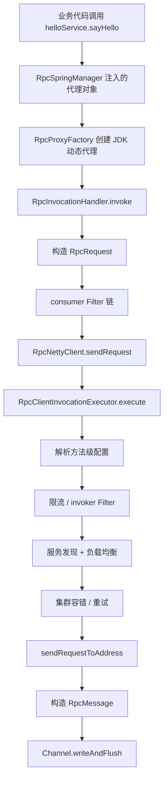

# consumer 侧：一次调用是怎么被组织起来的

## 1. 这一篇只回答一个问题

在业务代码里，你只写了这样一句：

```java
helloService.sayHello("consumer")
```

为什么最后会变成一次远程调用？

这篇不讲 provider，不讲协议细节，也不讲面试表达。

这篇只盯住 consumer 端，按真实源码把这条链拆开：

1. `@RpcReference` 字段为什么能被注入
2. 注入进去的为什么是代理对象
3. 代理对象收到调用以后怎么生成 `RpcRequest`
4. `RpcRequest` 又是如何经过调用编排最终被发出去的

你把这一篇吃透以后，consumer 侧所有“看起来像魔法”的地方都会变成一条可跟踪的代码链。

---

## 2. 从业务代码重新出发

consumer 示例应用如下：

```java
@SpringBootApplication
public class ExampleConsumerApplication {
    public static void main(String[] args) {
        SpringApplication.run(ExampleConsumerApplication.class, args);
    }

    @Component
    static class ConsumerRunner implements ApplicationRunner {
        @RpcReference
        private HelloService helloService;

        @Override
        public void run(ApplicationArguments args) {
            System.out.println(helloService.sayHello("consumer"));
            System.out.println("1 + 2 = " + helloService.add(1, 2));
        }
    }
}
```

先盯住这两行：

```java
@RpcReference
private HelloService helloService;
```

业务开发者会自然地产生两个问题：

1. 这个字段是谁注入的？
2. 注入进去的对象到底是什么？

这就是 consumer 主线的起点。

---

## 3. 第一步：`@RpcReference` 是谁处理的

在当前项目里，这件事主要由 `RpcSpringManager` 负责。

看它的 `postProcessBeforeInitialization(...)`：

```java
@Override
public Object postProcessBeforeInitialization(Object bean, String beanName) throws BeansException {
    ReflectionUtils.doWithFields(bean.getClass(), field -> injectReference(bean, field), this::isRpcReferenceField);
    return bean;
}
```

这段代码很关键，可以翻译成人话：

`每当 Spring 准备初始化一个 Bean 时，RpcSpringManager 都会先扫描这个 Bean 的字段，看看有没有 @RpcReference。`

如果有，就调用 `injectReference(bean, field)`。

继续看：

```java
private boolean isRpcReferenceField(Field field) {
    return field.isAnnotationPresent(RpcReference.class);
}

private void injectReference(Object bean, Field field) {
    RpcReference rpcReference = field.getAnnotation(RpcReference.class);
    Class<?> serviceType = rpcReference.value() == Void.class ? field.getType() : rpcReference.value();
    Object proxy = getConsumerBootstrap().getService(serviceType);
    ReflectionUtils.makeAccessible(field);
    ReflectionUtils.setField(field, bean, proxy);
}
```

这段代码要重点看清 4 步：

1. 先拿到字段上的 `@RpcReference`
2. 决定要代理的服务接口类型 `serviceType`
3. 调 `getConsumerBootstrap().getService(serviceType)` 生成服务对象
4. 把这个对象直接塞进字段里

也就是说，`helloService` 字段不是靠普通 Spring Bean 装配拿到的，而是 RPC 框架在 Bean 初始化前手动塞进去的。

这也是为什么 consumer 端即使没有本地 `HelloServiceImpl` Bean，字段依然能正常注入。

---

## 4. 第二步：为什么拿到的是代理对象

上一步里最重要的一句是：

```java
Object proxy = getConsumerBootstrap().getService(serviceType);
```

这里已经暴露出一个事实：

`consumer 端拿到的不是服务实现类，而是 bootstrap 创建出来的一个服务对象。`

继续往下看 `RpcConsumerBootstrap`：

```java
public <T> T getService(Class<T> serviceClass) {
    return proxyFactory.createProxyInstance(serviceClass);
}
```

到这里就彻底明白了。

`getService(...)` 根本不是“查找本地实现类”，而是“创建代理对象”。

再看 `RpcProxyFactory`：

```java
@SuppressWarnings("unchecked")
public <T> T createProxyInstance(Class<T> serviceClass) {
    if (serviceClass.isInterface()) {
        return createProxyBySDKInstance(serviceClass);
    }
    return createProxyByCGLibInstance(serviceClass);
}
```

如果服务类型是接口，就走 JDK 动态代理：

```java
@SuppressWarnings("unchecked")
public <T> T createProxyBySDKInstance(Class<T> serviceClass) {
    return (T) Proxy.newProxyInstance(
            serviceClass.getClassLoader(),
            new Class<?>[]{serviceClass},
            new RpcInvocationHandler(serviceClass, requireClient())
    );
}
```

这说明对于 `HelloService` 这种接口，consumer 注入进去的就是一个 JDK 动态代理对象，而真正拦截方法调用的是：

`RpcInvocationHandler`

你现在应该先把这句话记牢：

`@RpcReference 最终得到的不是实现类，而是一个由 RpcInvocationHandler 驱动的代理对象。`

---

## 5. 第三步：为什么必须用代理

这里不要只停留在“框架就是这么实现的”。

你还要明白：为什么必须这样实现。

如果不用代理，那么业务代码每次远程调用都得自己写：

1. 构造请求对象
2. 填服务名
3. 填方法名
4. 填参数
5. 选 provider 地址
6. 调网络发送
7. 取响应
8. 自己处理错误和超时

那业务层很快就会变成一堆基础设施代码。

用了代理以后，业务层仍然只写：

```java
helloService.sayHello("consumer")
```

而底层所有“把本地调用伪装成远程调用”的动作，都由代理对象接手。

所以代理不是为了炫技，而是为了把复杂度关到框架内部。

---

## 6. 第四步：方法调用真正被谁接住

前面我们已经定位到 `RpcInvocationHandler`。

现在看它的 `invoke(...)`：

```java
@Override
public Object invoke(Object proxy, Method method, Object[] args) throws Throwable {
    if (method.getDeclaringClass() == Object.class) {
        return method.invoke(this, args);
    }

    if (client == null) {
        throw new IllegalStateException("RPC client is not initialized");
    }

    RpcContext rpcContext = RpcContext.create()
            .setRequestId(UUID.randomUUID().toString());

    try {
        RpcRequest request = RpcRequest.builder()
                .requestId(rpcContext.getRequestId())
                .serviceName(serviceClass.getName())
                .methodName(method.getName())
                .parameterTypes(method.getParameterTypes())
                .parameters(args)
                .returnType(method.getReturnType())
                .build();

        FilterContext context = FilterContext.builder()
                .rpcContext(rpcContext)
                .request(request)
                .serviceClass(serviceClass)
                .build();
        RpcResponse response = (RpcResponse) new DefaultFilterChain(
                FilterManager.getFilters(FilterPhase.CONSUMER),
                filterContext -> client.sendRequest(filterContext.getRequest())
        ).proceed(context);

        if (response.getCode() != null && response.getCode() == 200) {
            return response.getData();
        }
        throw new RuntimeException("RPC invoke failed: " + response.getMessage());
    } finally {
        RpcContext.clear();
    }
}
```

这段代码建议你多看几遍。

它实际上完成了 consumer 侧最重要的入口转换。

### 先排除普通 Object 方法

```java
if (method.getDeclaringClass() == Object.class) {
    return method.invoke(this, args);
}
```

这一步是为了避免 `toString()`、`hashCode()`、`equals()` 这种基础方法也被当成 RPC 调用发出去。

### 创建请求上下文

```java
RpcContext rpcContext = RpcContext.create()
        .setRequestId(UUID.randomUUID().toString());
```

这一步为当前调用生成一个唯一请求标识，后面整条链路都能用这个 `requestId` 做跟踪。

### 把方法调用翻译成 `RpcRequest`

```java
RpcRequest request = RpcRequest.builder()
        .requestId(rpcContext.getRequestId())
        .serviceName(serviceClass.getName())
        .methodName(method.getName())
        .parameterTypes(method.getParameterTypes())
        .parameters(args)
        .returnType(method.getReturnType())
        .build();
```

这里非常关键。

一旦你看到这段代码，就应该明白：

`方法调用真正离开“本地调用形态”，变成“远程调用形态”的时刻，就是这里。`

原来只是：

```java
helloService.sayHello("consumer")
```

到了这里，已经被翻译成一份请求数据：

- 请求 ID
- 服务名
- 方法名
- 参数类型
- 参数值
- 返回值类型

接下来，框架就不需要再关心“原来那句 Java 代码长什么样”了，只需要沿着这份请求继续处理。

---

## 7. 第五步：为什么这里先过 consumer 过滤器链

在 `RpcInvocationHandler` 里，请求对象生成后，并没有直接发送，而是先进过滤器链：

```java
RpcResponse response = (RpcResponse) new DefaultFilterChain(
        FilterManager.getFilters(FilterPhase.CONSUMER),
        filterContext -> client.sendRequest(filterContext.getRequest())
).proceed(context);
```

这意味着当前项目把调用链切了一个扩展点出来。

consumer 过滤器阶段更适合放什么？

通常是这些偏“方法入口附近”的逻辑：

- 调用日志
- 请求参数标准化
- trace 信息补充
- 监控埋点
- 某些调用前校验

为什么不把这些逻辑直接写死在 `RpcInvocationHandler` 里？

因为这类逻辑常常是横切关注点，不应该和“构造请求”这个核心职责耦合在一起。

这也是当前项目一个值得学习的设计点：

`主流程类负责主流程，横切逻辑通过过滤器插入。`

---

## 8. 第六步：`client.sendRequest(...)` 不是简单的“发一下网络请求”

你在 `RpcInvocationHandler` 里看到：

```java
filterContext -> client.sendRequest(filterContext.getRequest())
```

很容易误以为这只是“把请求发出去”。

但在当前项目里，`client` 对应的是 `RpcTransport`，其具体实现之一是 `RpcNettyClient`。而 `RpcNettyClient.sendRequest(...)` 并不是一上来就操作 Netty Channel。

它先把请求交给 `RpcClientInvocationExecutor`：

```java
@Override
public RpcResponse sendRequest(RpcRequest rpcRequest) throws Exception {
    return invocationExecutor.execute(rpcRequest, this::sendRequestToAddress);
}
```

这句代码暴露出一个很重要的分层：

- `RpcInvocationHandler` 负责把方法调用变成 `RpcRequest`
- `RpcClientInvocationExecutor` 负责把这次请求真正组织成一次可执行的调用
- `sendRequestToAddress(...)` 才是底层定向发到某个地址

所以 consumer 侧不是“代理直接调网络”，而是“代理 -> 调用执行器 -> transport 发送”。

---

## 9. 第七步：调用执行器到底在组织什么

现在看 `RpcClientInvocationExecutor.execute(...)`：

```java
public RpcResponse execute(RpcRequest rpcRequest, RpcTransportInvoker transportInvoker) throws Exception {
    InvocationOptions options = invocationOptionsResolver.resolve(rpcRequest);
    String rateLimitKey = resolveRateLimitKey(rpcRequest, options);
    if (rateLimiterManager != null
            && options.isRateLimitEnabled()
            && !rateLimiterManager.tryAcquire(rateLimitKey, options.getRateLimitPermitsPerSecond())) {
        return RpcResponse.fail(
                ErrorCode.RATE_LIMIT_EXCEEDED.getCode(),
                ErrorCode.RATE_LIMIT_EXCEEDED.getDescription(),
                rpcRequest.getRequestId()
        );
    }
    applyInvocationOptions(rpcRequest, options);
    FilterContext context = FilterContext.builder()
            .request(rpcRequest)
            .invocationOptions(options)
            .build();

    return (RpcResponse) new DefaultFilterChain(
            FilterManager.getFilters(FilterPhase.INVOKER),
            filterContext -> invokeWithCluster(filterContext.getRequest(), transportInvoker, options)
    ).proceed(context);
}
```

这段代码值得逐层拆。

### 9.1 先解析方法级调用配置

```java
InvocationOptions options = invocationOptionsResolver.resolve(rpcRequest);
```

这一步的意义是：

`同一个服务的不同方法，不一定采用完全相同的调用策略。`

比如：

- `sayHello` 可能允许重试
- `add` 可能要更短超时
- 某些方法可能使用不同序列化方式
- 某些方法可能使用不同负载均衡策略

所以在真正发送前，框架先把“这次调用该怎么调”的选项解析出来。

### 9.2 再做限流

```java
if (rateLimiterManager != null
        && options.isRateLimitEnabled()
        && !rateLimiterManager.tryAcquire(rateLimitKey, options.getRateLimitPermitsPerSecond())) {
    return RpcResponse.fail(...);
}
```

这里说明限流不是网络层行为，而是调用治理行为。

它发生在“请求准备发出之前”。

### 9.3 把调用选项折叠进请求附件

```java
applyInvocationOptions(rpcRequest, options);
```

继续看它内部：

```java
private void applyInvocationOptions(RpcRequest rpcRequest, InvocationOptions options) {
    if (options.getReadTimeout() != null) {
        rpcRequest.getAttachments().put(InvocationAttachmentKeys.READ_TIMEOUT, String.valueOf(options.getReadTimeout()));
    }
    if (options.getSerializerName() != null && !options.getSerializerName().isBlank()) {
        rpcRequest.getAttachments().put(InvocationAttachmentKeys.SERIALIZER, options.getSerializerName());
    }
    if (options.getLoadBalancerName() != null && !options.getLoadBalancerName().isBlank()) {
        rpcRequest.getAttachments().put(InvocationAttachmentKeys.LOAD_BALANCER, options.getLoadBalancerName());
    }
}
```

这一步的价值在于：

后续层不需要直接依赖复杂的 `MethodConfig` 结构，它们只要从请求附件里读取标准化后的参数即可。

这相当于把“配置解释结果”贴在了请求上，让后面的层可以轻装前进。

### 9.4 再经过 invoker 过滤器链

```java
return (RpcResponse) new DefaultFilterChain(
        FilterManager.getFilters(FilterPhase.INVOKER),
        filterContext -> invokeWithCluster(filterContext.getRequest(), transportInvoker, options)
).proceed(context);
```

这一层过滤器比 consumer 阶段更靠近“真正执行一次远程调用”的位置。

它更适合挂什么？

- 熔断
- 降级
- 更靠近执行阶段的统计
- 围绕一次完整调用的治理逻辑

所以 consumer 阶段和 invoker 阶段不是重复的，而是位置不同、职责不同。

---

## 10. 第八步：服务地址是谁选的

真正选择 provider 地址的逻辑藏在 `invokeOnce(...)` 里：

```java
private Callable<RpcResponse> invokeOnce(RpcRequest rpcRequest,
                                         RpcTransportInvoker transportInvoker,
                                         InvocationOptions options) {
    return () -> {
        InetSocketAddress address = serviceResolver.resolve(
                rpcRequest.getServiceName(),
                options.getLoadBalancerName()
        );
        RpcResponse response = transportInvoker.invoke(rpcRequest, address);
        if (response.getCode() == null || response.getCode() != 200) {
            throw new RpcException(ErrorCode.SERVICE_EXCEPTION, "RPC invoke failed: " + response.getMessage());
        }

        CircuitBreaker instanceCircuitBreaker = circuitBreakerManager.getInstanceCircuitBreaker(
                rpcRequest.getServiceName(), address);
        instanceCircuitBreaker.recordSuccess();
        return response;
    };
}
```

这里要看懂两层意思。

### 第一层：地址解析独立成专门组件

```java
InetSocketAddress address = serviceResolver.resolve(...)
```

说明“选择调用哪个 provider”不是代理层做的，也不是 Netty 客户端做的，而是交给 `serviceResolver`。

这样就把“选地址”从“发请求”里拆出来了。

### 第二层：实例级熔断状态在这里记录

```java
instanceCircuitBreaker.recordSuccess();
```

也就是说，框架不仅关心“服务整体是否健康”，还关心“具体某个实例是否健康”。

这就为后续按实例做熔断和恢复提供了基础。

---

## 11. 第九步：集群策略和重试发生在哪里

真正把容错策略接进来的是 `invokeWithCluster(...)`：

```java
private RpcResponse invokeWithCluster(RpcRequest rpcRequest,
                                      RpcTransportInvoker transportInvoker,
                                      InvocationOptions options) throws Exception {
    ClusterInvoker clusterInvoker = ClusterInvokerFactory.create(
            options.getClusterStrategy(),
            retryExecutor,
            invokeOnce(rpcRequest, transportInvoker, options),
            options.getRetryTimes()
    );
    return clusterInvoker.invoke(rpcRequest, transportInvoker);
}
```

这段代码说明几件事：

1. 集群容错是单独一层策略，不是网络客户端内部细节
2. 重试不是代理层行为，也不是连接重连行为
3. `FAIL_FAST`、`FAIL_OVER` 这类策略，都是在这个阶段决定的

这很重要。

因为很多新手会把“请求重试”和“连接重连”混在一起。

它们不是一回事：

- 请求重试：一次业务调用失败后，要不要重新发起一次调用
- 连接重连：底层网络连接断了，要不要重新建立连接

当前项目把这两件事拆开了，这是合理的。

---

## 12. 第十步：真正往某个地址发请求的是谁

当调用执行器已经选好了地址并决定要真正发送时，会回调 transport 层的 `sendRequestToAddress(...)`。

在 `RpcNettyClient` 里：

```java
private RpcResponse sendRequestToAddress(RpcRequest rpcRequest, InetSocketAddress address) throws Exception {
    long requestId = generateRequestId();
    rpcRequest.setRequestId(String.valueOf(requestId));
    CompletableFuture<RpcResponse> future = requestManager.addRequest(requestId);

    RpcConnection connection = connectionPool.getConnection(address.getHostString(), address.getPort());
    RpcMessage message = buildRequestMessage(rpcRequest, requestId);

    connection.getChannel().writeAndFlush(message).sync();
    return future.get(resolveReadTimeout(rpcRequest), TimeUnit.MILLISECONDS);
}
```

这是 consumer 侧真正“落地到网络发送”的关键代码。

这段代码的顺序值得记住：

1. 生成请求 ID
2. 在 `requestManager` 里登记一个 future
3. 从连接池拿到目标连接
4. 把 `RpcRequest` 包成 `RpcMessage`
5. 写入 Channel 发送出去
6. 等待异步响应完成 future

这里已经非常接近“真实网络编程”了。

---

## 13. 为什么要有 `RequestManager`

上一步里最容易被忽视的是：

```java
CompletableFuture<RpcResponse> future = requestManager.addRequest(requestId);
```

这个设计解决的是一个核心问题：

`发送请求和收到响应不是同一个时间点。`

请求发出去以后，不可能同步地立刻从 `writeAndFlush` 返回响应对象。真正的响应是稍后由 Netty handler 异步处理进来的。

所以必须有一个地方，把：

- 当前请求 ID
- 对应等待中的 future

绑定起来。

等响应回来时，再根据响应里的请求 ID 找到对应的 future 并完成它。

这就是典型的“同步接口外观 + 异步网络实现”。

---

## 14. 第十一步：请求在发出去之前会被包装成什么

在 `RpcNettyClient` 里，`buildRequestMessage(...)` 非常值得看：

```java
private RpcMessage buildRequestMessage(RpcRequest rpcRequest, long requestId) {
    byte requestSerializerType = resolveSerializerType(rpcRequest);
    RpcHeader header = RpcHeader.builder()
            .magicNumber(RpcHeader.MAGIC_NUMBER)
            .version(RpcHeader.VERSION)
            .serializerType(requestSerializerType)
            .messageType(RpcMessageType.REQUEST.getCode())
            .reserved((byte) 0)
            .requestId(requestId)
            .build();

    RpcMessage message = new RpcMessage();
    message.setHeader(header);
    message.setBody(rpcRequest);
    return message;
}
```

这里说明一个很重要的变化：

在代理层、调用执行器层，大家操作的是 `RpcRequest`。

而到了协议/传输边界，真正在线路上发送的是 `RpcMessage`。

`RpcMessage` 比 `RpcRequest` 多了协议头，也就多了这些协议级信息：

- 魔数
- 版本号
- 序列化方式
- 消息类型
- 请求 ID

你可以把它理解成：

- `RpcRequest` 是业务请求模型
- `RpcMessage` 是传输消息模型

---

## 15. 第十二步：序列化方式为什么可以被方法级配置覆盖

继续看 `RpcNettyClient.resolveSerializerType(...)`：

```java
private byte resolveSerializerType(RpcRequest rpcRequest) {
    String serializerName = rpcRequest.getAttachments().get(InvocationAttachmentKeys.SERIALIZER);
    if (serializerName == null || serializerName.isBlank()) {
        return serializerType;
    }
    return (byte) SerializerFactory.getSerializer(serializerName).getSerializerType();
}
```

这和前面的 `applyInvocationOptions(...)` 正好连上了。

前面调用执行器会把方法级配置解析后折叠进请求附件里，这里 transport 层再从附件里读取具体序列化器。

这就是“配置先解释，再由后续层消费”的完整闭环。

这个设计很好，因为它避免了 transport 层直接依赖高层配置对象。

---

## 16. 一张 consumer 主链路图



看到这张图时，你应该已经能把各个类名和职责对上了。

---

## 17. 这一整段链路为什么要拆这么多层

很多人第一次看会觉得：

`一次调用而已，为什么要拆成这么多类？`

你可以反过来想：如果不拆，会发生什么？

如果所有事情都塞到 `RpcInvocationHandler` 里，那它必须负责：

- 构造请求
- 解析方法配置
- 限流
- 熔断
- 负载均衡
- 服务发现
- 重试
- Netty 发送
- 响应等待
- 错误处理

那这个类会变得巨大、脆弱、难扩展、难测试。

而当前项目的拆法是：

- 代理层：拦截本地调用
- 调用执行器：组织一次调用
- 服务解析器：选地址
- 集群层：做容错
- transport 层：发请求
- protocol 层：编码解码

这不是为了“看起来高级”，而是为了让每层的变化范围尽量可控。

---

## 18. 站在小白角度，最容易混淆的 4 组概念

### 18.1 代理 和 transport

- 代理：负责接住本地方法调用
- transport：负责把请求发到远程机器

### 18.2 服务发现 和 负载均衡

- 服务发现：拿到有哪些 provider 地址可选
- 负载均衡：从可选地址中决定这次选哪个

### 18.3 请求重试 和 连接重连

- 请求重试：一次业务调用失败后再尝试一次
- 连接重连：底层连接断了以后重建连接

### 18.4 `RpcRequest` 和 `RpcMessage`

- `RpcRequest`：业务请求模型
- `RpcMessage`：协议传输消息模型

这四组区别一旦清楚，consumer 侧理解成本会立刻下降。

---

## 19. 读完这一篇，你应该能回答的问题

请你试着自己回答下面这些问题。如果能答出来，说明 consumer 主线已经真正进脑子里了。

1. `@RpcReference` 是谁处理的？
2. `helloService` 字段里被放进去的到底是什么对象？
3. `RpcRequest` 是在哪个类里创建的？
4. 为什么创建完 `RpcRequest` 以后还要经过过滤器链？
5. 调用执行器相比代理层，多负责了哪些事情？
6. provider 地址是谁决定的？
7. `RpcRequest` 什么时候被包成 `RpcMessage`？
8. 为什么需要 `RequestManager` 和 future？

如果有一题你还回答不上来，回头再看对应段落，不要急着往后跳。

---

## 20. 下一篇看什么

下一篇是 `03-provider-side-deep-dive.md`。

这一篇已经把 consumer 端“怎么把请求组织出来”讲清楚了。

下一篇要解决的问题是：

`provider 收到这个请求以后，怎么把它一步步还原成 HelloServiceImpl.sayHello(...) 的真实执行。`

---

## 21. 本篇源码定位

建议你打开以下源码，边读边对照本文：

- `example-consumer/src/main/java/com/rpc/ExampleConsumerApplication.java`
- `rpc-spring/src/main/java/com/rpc/spring/RpcSpringManager.java`
- `rpc-core/src/main/java/com/rpc/core/api/bootstrap/RpcConsumerBootstrap.java`
- `rpc-core/src/main/java/com/rpc/core/invoke/proxy/RpcProxyFactory.java`
- `rpc-core/src/main/java/com/rpc/core/invoke/proxy/impl/RpcInvocationHandler.java`
- `rpc-core/src/main/java/com/rpc/core/transport/netty/client/invocation/RpcClientInvocationExecutor.java`
- `rpc-core/src/main/java/com/rpc/core/transport/netty/client/RpcNettyClient.java`
