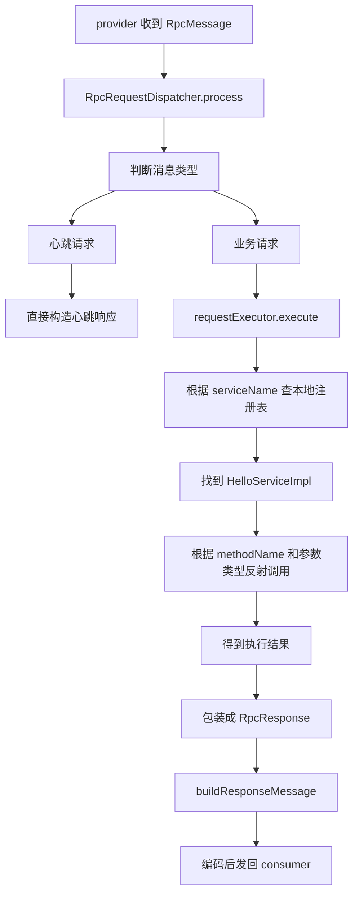
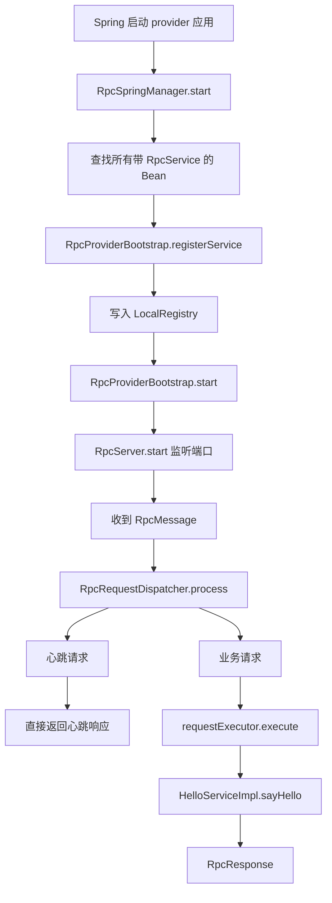

# provider 侧：远程请求是怎么变成真实方法执行的

## 1. 这一篇解决的问题

上一篇我们站在 consumer 端，已经把这件事讲清楚了：

`本地接口调用是如何被翻译成一份远程请求并发出去的。`

这一篇只看 provider 端。

我们要回答的是：

`provider 收到一个网络请求以后，怎么一步步把它还原成 HelloServiceImpl.sayHello(...) 的真实执行。`

如果 consumer 端最重要的关键词是“代理”，那 provider 端最重要的关键词就是：

- 服务暴露
- 本地注册表
- 请求分流
- 业务执行
- 响应返回

你把这五个关键词吃透，provider 侧主线就通了。

---

## 2. 先从最简单的 provider 业务代码开始

provider 端业务实现其实非常简单：

```java
@RpcService(HelloService.class)
public class HelloServiceImpl implements HelloService {
    @Override
    public String sayHello(String name) {
        return "Hello, " + name + "!";
    }

    @Override
    public String sayHi(String name) {
        return "Hi, " + name + "! Nice to meet you!";
    }

    @Override
    public Integer add(Integer a, Integer b) {
        return a + b;
    }
}
```

这段代码说明一件很重要的事：

`provider 端业务实现本身并不复杂，复杂度主要在于框架如何把它发布成远程服务。`

所以 provider 主线不是从 `sayHello(...)` 开始的，而是从 `@RpcService` 开始的。

---

## 3. 第一步：provider 启动时先装配服务端基础设施

provider 侧的核心启动入口是 `RpcProviderBootstrap.fromConfig(...)`：

```java
public static RpcProviderBootstrap fromConfig(RpcFrameworkConfig frameworkConfig) {
    DegradationPolicy degradationPolicy = DegradationPolicyFactory.create(
            frameworkConfig.getServerDegradationPolicy(),
            frameworkConfig.getServerDegradationDefaultValues()
    );
    FilterManager.configure(frameworkConfig);
    FilterRuntimeConfigurator.configureProvider(frameworkConfig, degradationPolicy);

    ServiceRegistry serviceRegistry = ServiceRegistryFactory.create(frameworkConfig);
    RpcServerConfig serverConfig = RpcServerConfig.custom()
            .transportType(frameworkConfig.getTransportType())
            .host(frameworkConfig.getServerHost())
            .port(frameworkConfig.getServerPort())
            .bossThreads(frameworkConfig.getBossThreads())
            .workerThreads(frameworkConfig.getWorkerThreads())
            .bizCoreThreads(frameworkConfig.getBizCoreThreads())
            .bizMaxThreads(frameworkConfig.getBizMaxThreads())
            .bizQueueCapacity(frameworkConfig.getBizQueueCapacity())
            .shutdownTimeout(frameworkConfig.getShutdownTimeout())
            .readerIdleTime(frameworkConfig.getServerReaderIdleTime())
            .writerIdleTime(frameworkConfig.getServerWriterIdleTime())
            .allIdleTime(frameworkConfig.getServerAllIdleTime());
    RpcServer rpcServer = RpcServerFactory.create(serverConfig, serviceRegistry);
    return new RpcProviderBootstrap(serviceRegistry, rpcServer, frameworkConfig);
}
```

你可以先把它理解成：

`provider 启动时先把服务端运行环境准备好。`

这里准备的不是业务服务本身，而是服务端基础设施：

- 注册中心客户端
- 过滤器
- 降级策略
- 服务端网络配置
- 线程池配置
- 读写空闲配置
- 真正的 `RpcServer`

所以 provider 的第一件事不是“调用业务类”，而是“先把一个能接收远程请求的服务端搭起来”。

---

## 4. 第二步：服务实现是如何被注册进去的

provider 端如果只启动了一个 `RpcServer`，还不够。

因为服务端即使已经开始监听端口，如果它不知道：

- `com.rpc.HelloService` 对应哪个本地对象

那它仍然无法处理业务请求。

这件事由 `registerService(...)` 解决：

```java
public RpcProviderBootstrap registerService(Class<?> serviceInterface, Object serviceImpl) {
    rpcServer.getLocalRegistry().register(serviceInterface.getName(), serviceImpl);
    return this;
}
```

这段代码非常重要。

它说明 provider 端会在本地维护一份映射关系：

```text
服务接口全限定名 -> 服务实现对象
```

比如：

```text
com.rpc.HelloService -> HelloServiceImpl 实例
```

这份映射关系就是后面请求执行时的依据。

---

## 5. 为什么必须有本地注册表

这个问题值得单独讲，因为很多人第一次看都会混。

consumer 端会通过注册中心找到 provider 地址，这没问题。

但 provider 收到请求之后，请求里只有这些信息：

- 服务名
- 方法名
- 参数类型
- 参数值

它并不会直接携带一个本地 Java 对象引用。

所以 provider 必须再做一次“本地查表”：

1. 根据服务名找到服务对象
2. 根据方法名和参数类型找到方法
3. 在这个对象上执行这个方法

这就是本地注册表存在的意义。

它解决的是：

`请求已经到达当前 provider 以后，接下来该由本地哪个对象来处理。`

这和注册中心解决的问题完全不同。

---

## 6. 第三步：Spring 场景下，谁负责把 `@RpcService` Bean 发布出去

在当前项目里，Spring 集成层会帮你处理这件事。

`RpcSpringManager.start()` 里有一段非常关键的代码：

```java
@Override
public void start() {
    if (running) {
        return;
    }
    String[] serviceBeanNames = applicationContext.getBeanNamesForAnnotation(RpcService.class);
    if (serviceBeanNames.length > 0) {
        RpcProviderBootstrap bootstrap = getProviderBootstrap();
        for (String beanName : serviceBeanNames) {
            Object bean = applicationContext.getBean(beanName);
            RpcService rpcService = bean.getClass().getAnnotation(RpcService.class);
            bootstrap.registerService(resolveServiceInterface(bean.getClass(), rpcService), bean);
        }
        try {
            bootstrap.start();
        } catch (Exception e) {
            throw new IllegalStateException("Failed to start rpc provider bootstrap", e);
        }
    }
    running = true;
}
```

这段代码可以翻译成一句非常朴素的人话：

`Spring 容器启动起来以后，RpcSpringManager 会把所有带 @RpcService 的 Bean 收集出来，再统一交给 RpcProviderBootstrap 发布。`

这说明 Spring 场景下 provider 发布流程不是“手动 new 服务实现 -> 手动注册”，而是：

1. Spring 先负责 Bean 生命周期
2. RPC 框架再把这些 Bean 暴露成远程服务

这两层职责是分开的。

---

## 7. 第四步：服务端真正开始监听是在什么时候

当服务都注册到本地注册表之后，provider 最终会调用：

```java
public void start() throws Exception {
    if (frameworkConfig.isServerAutoRegisterAnnotatedServices() && !configuredServicesRegistered) {
        registerConfiguredServices();
    }
    rpcServer.start();
}
```

这里最关键的是最后一句：

```java
rpcServer.start();
```

也就是说，provider 端真正对外进入“可接收请求”状态，是在 `RpcServer` 启动并开始监听端口之后。

从全链路视角看，这意味着：

1. 服务要先完成注册
2. 本地注册表要先准备好
3. 服务端网络能力再启动
4. 外部 consumer 才能真正调用它

这个顺序很合理。因为如果服务端先监听端口，但本地服务还没注册好，就会出现请求来了却找不到服务对象的问题。

---

## 8. 第五步：provider 收到消息后先进入谁

provider 端收到网络消息以后，并不是直接就反射调用业务类。

它会先进入 `RpcRequestDispatcher`：

```java
@Override
public RpcMessage process(RpcMessage message) {
    RpcHeader header = message.getHeader();
    RpcMessageType messageType = RpcMessageType.fromCode(header.getMessageType());

    return switch (messageType) {
        case HEARTBEAT_REQUEST -> handleHeartbeatRequest(message);
        case REQUEST -> handleBusinessRequest(message);
        default -> null;
    };
}
```

这段代码体现了 provider 端的第一层分工：

`先分流，再执行。`

也就是说，provider 先判断收到的是什么类型的消息。

如果是心跳请求，就走心跳处理；如果是真正的业务请求，才进入业务执行链。

为什么不能收到什么都直接执行？

因为网络上传输的不止业务消息，还可能有：

- 心跳消息
- 未来可能扩展的其他消息类型

所以服务端入口必须先做消息级分流。

---

## 9. 第六步：心跳和业务请求为什么要分开处理

先看心跳处理：

```java
private RpcMessage handleHeartbeatRequest(RpcMessage request) {
    RpcHeartbeat heartbeatRequest = (RpcHeartbeat) request.getBody();
    long requestId = heartbeatRequest.getRequestId();
    RpcHeartbeat heartbeatResponse = RpcHeartbeat.createResponse(requestId);

    RpcHeader header = RpcHeader.builder()
            .magicNumber(RpcHeader.MAGIC_NUMBER)
            .version(RpcHeader.VERSION)
            .serializerType((byte) 0)
            .messageType(RpcMessageType.HEARTBEAT_RESPONSE.getCode())
            .reserved((byte) 0)
            .requestId(requestId)
            .build();

    RpcMessage response = new RpcMessage();
    response.setHeader(header);
    response.setBody(heartbeatResponse);
    return response;
}
```

这段代码说明心跳根本不需要走业务执行链。

心跳的目标只是：

- 确认连接还活着
- 保持连接健康
- 让客户端能感知往返延迟

如果心跳还要再经过本地服务查找、反射调用、业务线程池，那既浪费资源，也让语义变得混乱。

所以 provider 端第一层分流是非常必要的。

---

## 10. 第七步：真正的业务请求是怎么处理的

再看业务请求分支：

```java
private RpcMessage handleBusinessRequest(RpcMessage requestMessage) {
    RpcHeader requestHeader = requestMessage.getHeader();
    RpcRequest rpcRequest = (RpcRequest) requestMessage.getBody();

    RpcResponse rpcResponse;
    if (!serverLifecycle.isAcceptingRequests()) {
        rpcResponse = RpcResponse.fail(503, "Server is shutting down", rpcRequest.getRequestId());
    } else {
        rpcResponse = requestExecutor.execute(rpcRequest);
    }
    return buildResponseMessage(rpcResponse, requestHeader);
}
```

这段代码的顺序很清楚：

1. 取请求头
2. 取请求体 `RpcRequest`
3. 先判断当前服务端是否还接受新请求
4. 如果可以，就交给 `requestExecutor.execute(rpcRequest)`
5. 最后把执行结果包装成响应消息

这里要注意两个设计点。

### 10.1 provider 端也考虑了优雅停机

```java
if (!serverLifecycle.isAcceptingRequests()) {
    rpcResponse = RpcResponse.fail(503, "Server is shutting down", rpcRequest.getRequestId());
}
```

这说明 provider 不是简单粗暴地断掉服务，而是考虑了“停止接收新请求但让在途请求尽量处理完”的场景。

### 10.2 dispatcher 本身不负责执行业务

`RpcRequestDispatcher` 只负责分流和转发，不负责真正执行业务方法。

这也是很合理的拆分。

---

## 11. 第八步：为什么还要有 `requestExecutor`

很多新手看到这里会问：

`既然 dispatcher 都已经拿到 RpcRequest 了，为什么不直接反射调用？`

答案和 consumer 端类似：

因为 dispatcher 的职责是“消息分流”，不是“业务执行”。

真正的业务执行还可能涉及：

- provider 侧过滤器
- 本地注册表查找
- 反射调用
- 统一异常处理
- 线程池调度
- 结果封装

如果把这些都写进 dispatcher，它就会变成一个巨大的入口类。

所以 provider 端把“收到什么消息”和“如何执行业务”拆成两层，是合理的。

---

## 12. provider 侧真正执行时，脑子里要有的流程图

即使你暂时还没打开 `RpcRequestExecutor` 的源码，也应该先建立下面这张心智图：



有了这张图，后面你看 provider 源码时就不会迷路。

---

## 13. 第九步：为什么响应消息会沿用请求头里的序列化方式

看 `buildResponseMessage(...)`：

```java
private RpcMessage buildResponseMessage(Object body, RpcHeader requestHeader) {
    RpcHeader responseHeader = RpcHeader.builder()
            .magicNumber(RpcHeader.MAGIC_NUMBER)
            .version(RpcHeader.VERSION)
            .serializerType(requestHeader.getSerializerType())
            .messageType(RpcMessageType.RESPONSE.getCode())
            .reserved((byte) 0)
            .requestId(requestHeader.getRequestId())
            .build();

    RpcMessage responseMessage = new RpcMessage();
    responseMessage.setHeader(responseHeader);
    responseMessage.setBody(body);
    return responseMessage;
}
```

这里有两个非常重要的细节。

### 13.1 响应沿用同一个 `requestId`

```java
.requestId(requestHeader.getRequestId())
```

这样 consumer 端才能把“这个响应”匹配回“之前发出的那个请求”。

### 13.2 响应沿用请求里的 `serializerType`

```java
.serializerType(requestHeader.getSerializerType())
```

这样可以保证：

- 请求用什么序列化方式发来的
- 响应就用同样的方式回去

否则 consumer 发 protobuf，provider 回 json，consumer 端就会解码失败。

所以这是协议一致性的基本保障。

---

## 14. 第十步：provider 侧最终会落到哪一行业务代码

虽然中间经过了很多层，但最终落点还是这个最普通的方法：

```java
@Override
public String sayHello(String name) {
    return "Hello, " + name + "!";
}
```

这件事很重要，因为它能帮你建立一个健康的理解方式：

框架再复杂，最终目标也只是把一次远程请求还原成一次普通本地方法执行。

也就是说，RPC 框架做的不是“创造一种新的业务执行方式”，而是“跨进程搬运一次本地方法调用语义”。

这句话非常值得反复体会。

---

## 15. 为什么 provider 业务代码能保持这么干净

provider 端业务实现之所以还能写得像普通 Java 类，是因为框架把复杂度提前吸收掉了。

这些复杂度主要包括：

- 服务暴露
- 服务注册
- 本地映射
- 协议编解码
- 消息分流
- 线程模型
- 统一异常处理
- 响应包装

如果没有 RPC 框架，这些事情都要业务自己处理。

那 `HelloServiceImpl` 就不可能这么干净。

所以 provider 代码干净，不代表系统简单；它只代表复杂度被收纳得比较好。

---

## 16. 站在 provider 角度，再看一次全链路

你现在可以用 provider 视角重新描述一次请求过程：

```text
consumer 发来一个 RpcMessage
-> provider 先解码
-> RpcRequestDispatcher 根据 messageType 分流
-> 如果是心跳，直接生成心跳响应
-> 如果是业务请求，交给 requestExecutor
-> requestExecutor 按 serviceName 找本地服务对象
-> 反射调用目标方法
-> 执行结果包装成 RpcResponse
-> 再包装成 RpcMessage
-> 编码后通过网络返回 consumer
```

这段描述如果你能自然说出来，说明 provider 主线已经建立起来了。

---

## 17. 新手最容易在 provider 侧搞混的 3 件事

### 17.1 注册中心 和 本地注册表

- 注册中心：给 consumer 提供 provider 地址
- 本地注册表：给 provider 提供本地服务对象映射

### 17.2 dispatcher 和 executor

- dispatcher：先按消息类型分流
- executor：真正执行业务请求

### 17.3 业务实现类 和 服务端基础设施

- 业务实现类：只写业务逻辑
- 服务端基础设施：负责接收、分发、执行、返回

如果这三组东西你不再混，provider 端源码就不会再觉得乱。

---

## 18. 一张 provider 启动和处理图



这张图建议和上一节的解释一起反复看。

---

## 19. 读完这一篇，你应该能回答的问题

1. `@RpcService` Bean 是谁收集出来并发布的？
2. `registerService(...)` 到底注册到了哪里？
3. 为什么 provider 需要本地注册表？
4. 为什么 `RpcRequestDispatcher` 要先按消息类型分流？
5. 心跳请求为什么不能走普通业务执行链？
6. 为什么响应要沿用请求的 `requestId` 和 `serializerType`？
7. 整条 provider 链路最终会落到哪一类代码？

这些问题如果你还回答不顺，说明 provider 主线还没完全吃透。

---

## 20. 下一篇看什么

下一篇是 `04-spring-integration-story.md`。

到这里，你已经知道：

- consumer 端怎么拿到代理对象
- provider 端怎么把服务发布出去

下一篇要解决的问题是：

`Spring 在这个项目里到底扮演了什么角色，为什么框架能无缝接进 Spring 生命周期。`

---

## 21. 本篇源码定位

建议对照阅读这些文件：

- `example-provider/src/main/java/com/rpc/HelloServiceImpl.java`
- `rpc-spring/src/main/java/com/rpc/spring/RpcSpringManager.java`
- `rpc-core/src/main/java/com/rpc/core/api/bootstrap/RpcProviderBootstrap.java`
- `rpc-core/src/main/java/com/rpc/core/transport/netty/server/dispatch/RpcRequestDispatcher.java`
