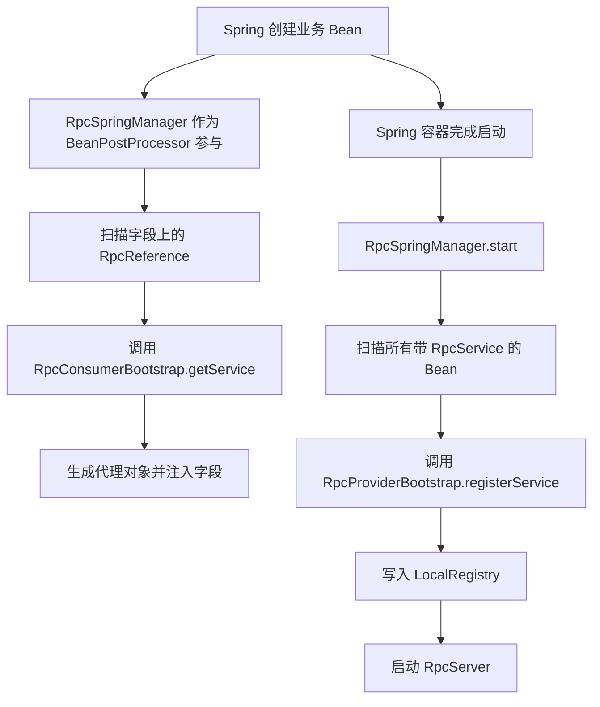

# Spring 集成：框架是怎么接进容器生命周期的

## 1. 为什么这一篇很重要

如果你只看 `rpc-core`，会觉得这个项目已经能独立工作了。

这没错。

但当前仓库里的真实使用方式并不是“业务代码手动 new bootstrap 再手动注入代理”，而是通过 Spring / Spring Boot 来接入。

对小白来说，这一篇非常重要，因为很多“为什么它能自动工作”的问题，本质上都不是 RPC 原理问题，而是 Spring 生命周期问题。

比如：

1. `@RpcReference` 为什么会自动注入？
2. `@RpcService` 为什么会自动发布？
3. 为什么业务代码几乎不需要自己手动装配 bootstrap？

这些问题的答案，都在 Spring 集成层。

---

## 2. 先建立一个总体认识

你可以把当前项目拆成三层：

- `rpc-core`：RPC 本体
- `rpc-spring`：把 RPC 接入 Spring 容器
- `rpc-spring-boot-starter`：把 Spring 集成再做成 Boot 自动装配

如果把这三层讲得更直白一点：

- `rpc-core` 负责“RPC 到底怎么工作”
- `rpc-spring` 负责“Spring 怎么感知 RPC”
- `starter` 负责“Boot 项目怎样尽量少写配置就能用上 RPC”

所以 Spring 集成层不是另一个 RPC 核心，而是一层“接线层”。

---

## 3. 第一件事：Spring 如何处理 `@RpcReference`

consumer 端最显眼的写法是：

```java
@RpcReference
private HelloService helloService;
```

这背后最关键的代码在 `RpcSpringManager.postProcessBeforeInitialization(...)`：

```java
@Override
public Object postProcessBeforeInitialization(Object bean, String beanName) throws BeansException {
    ReflectionUtils.doWithFields(bean.getClass(), field -> injectReference(bean, field), this::isRpcReferenceField);
    return bean;
}
```

这段代码的意思是：

`Spring 在初始化任意 Bean 之前，RpcSpringManager 都会先扫描它的字段。只要发现字段上有 @RpcReference，就执行注入。`

这正是 BeanPostProcessor 的典型用法。

如果你对 BeanPostProcessor 还不熟，可以先把它理解成：

`Spring 在 Bean 创建流程中提供的一个插手点。`

RPC 框架就是利用这个插手点，把自己的代理对象放进去。

---

## 4. 具体怎么注入

继续看 `injectReference(...)`：

```java
private void injectReference(Object bean, Field field) {
    RpcReference rpcReference = field.getAnnotation(RpcReference.class);
    Class<?> serviceType = rpcReference.value() == Void.class ? field.getType() : rpcReference.value();
    Object proxy = getConsumerBootstrap().getService(serviceType);
    ReflectionUtils.makeAccessible(field);
    ReflectionUtils.setField(field, bean, proxy);
}
```

这里有 4 个关键动作。

### 4.1 先拿注解信息

```java
RpcReference rpcReference = field.getAnnotation(RpcReference.class);
```

### 4.2 决定服务类型

```java
Class<?> serviceType = rpcReference.value() == Void.class ? field.getType() : rpcReference.value();
```

如果注解里没有显式指定接口类型，就默认用字段类型。

### 4.3 向 consumer bootstrap 要一个服务对象

```java
Object proxy = getConsumerBootstrap().getService(serviceType);
```

这里已经说明：Spring 集成层自己不创建代理，它只是调用 RPC 核心层的 consumer bootstrap 来拿代理。

### 4.4 反射写回字段

```java
ReflectionUtils.makeAccessible(field);
ReflectionUtils.setField(field, bean, proxy);
```

这样业务 Bean 后续拿到的就是代理对象。

这整个过程体现了一个非常清楚的职责分工：

- Spring 集成层负责“把对象塞进 Spring Bean”
- RPC 核心层负责“这个对象到底该是什么”

---

## 5. 第二件事：Spring 如何处理 `@RpcService`

provider 端最显眼的写法是：

```java
@RpcService(HelloService.class)
public class HelloServiceImpl implements HelloService {
    ...
}
```

这背后对应的是 `RpcSpringManager.start()`：

```java
@Override
public void start() {
    if (running) {
        return;
    }
    String[] serviceBeanNames = applicationContext.getBeanNamesForAnnotation(RpcService.class);
    if (serviceBeanNames.length > 0) {
        RpcProviderBootstrap bootstrap = getProviderBootstrap();
        for (String beanName : serviceBeanNames) {
            Object bean = applicationContext.getBean(beanName);
            RpcService rpcService = bean.getClass().getAnnotation(RpcService.class);
            bootstrap.registerService(resolveServiceInterface(bean.getClass(), rpcService), bean);
        }
        try {
            bootstrap.start();
        } catch (Exception e) {
            throw new IllegalStateException("Failed to start rpc provider bootstrap", e);
        }
    }
    running = true;
}
```

这段代码建议逐句理解。

### 5.1 先找出所有带 `@RpcService` 的 Bean

```java
String[] serviceBeanNames = applicationContext.getBeanNamesForAnnotation(RpcService.class);
```

### 5.2 从容器里拿出真正的 Bean 对象

```java
Object bean = applicationContext.getBean(beanName);
```

### 5.3 解析这个服务暴露成哪个接口

```java
RpcService rpcService = bean.getClass().getAnnotation(RpcService.class);
bootstrap.registerService(resolveServiceInterface(bean.getClass(), rpcService), bean);
```

### 5.4 最后启动 provider bootstrap

```java
bootstrap.start();
```

这条链说明：

`Spring 负责创建 Bean，RPC 框架负责把这些 Bean 发布成远程服务。`

这个职责边界很干净。

---

## 6. 为什么 `RpcSpringManager` 同时处理 consumer 和 provider

你可能会问：

`为什么不是一个类专门处理 @RpcReference，另一个类专门处理 @RpcService？`

当前项目把这两件事都收口在 `RpcSpringManager`，这是可以理解的。

因为它们本质上都属于：

`Spring 容器和 RPC 框架之间的对接工作。`

也就是说，这个类更像一个“Spring 集成协调器”，而不是某条单一链路上的纯业务类。

它承担的两个核心任务是：

- consumer 侧：在 Bean 初始化前注入代理
- provider 侧：在容器启动后发布服务

这两件事位置不同，但都属于容器生命周期对接。

---

## 7. 第三件事：为什么 `RpcSpringManager` 要实现这么多 Spring 接口

`RpcSpringManager` 的类声明是：

```java
public class RpcSpringManager implements BeanPostProcessor, SmartLifecycle, DisposableBean,
        ApplicationContextAware, PriorityOrdered {
```

这行代码信息量非常大。

### 7.1 `BeanPostProcessor`

作用：在 Bean 初始化前后插手。

对应场景：注入 `@RpcReference` 代理对象。

### 7.2 `SmartLifecycle`

作用：跟随 Spring 容器启动和停止。

对应场景：在容器启动后发布 `@RpcService` 服务，在容器关闭时做清理。

### 7.3 `DisposableBean`

作用：容器销毁时释放资源。

对应场景：关闭内部创建的 bootstrap。

### 7.4 `ApplicationContextAware`

作用：拿到 `ApplicationContext`。

对应场景：扫描带注解的 Bean、从容器里找已有配置或 bootstrap。

### 7.5 `PriorityOrdered`

作用：控制执行顺序。

对应场景：尽量较早参与 Bean 处理流程，保证代理注入时机正确。

如果你把这些接口各自对应的角色理解清楚，这个类就不再像一个“什么都实现一点的奇怪类”，而像一个很标准的 Spring 集成中枢。

---

## 8. 第四件事：`getConsumerBootstrap()` 为什么不是直接 new

看这段代码：

```java
private RpcConsumerBootstrap getConsumerBootstrap() {
    if (consumerBootstrap != null) {
        return consumerBootstrap;
    }
    RpcConsumerBootstrap existing = applicationContext.getBeanProvider(RpcConsumerBootstrap.class).getIfAvailable();
    if (existing != null) {
        consumerBootstrap = existing;
        return consumerBootstrap;
    }
    RpcFrameworkConfig frameworkConfig = applicationContext.getBeanProvider(RpcFrameworkConfig.class).getIfAvailable();
    consumerBootstrap = frameworkConfig == null
            ? RpcConsumerBootstrap.fromConfig()
            : RpcConsumerBootstrap.fromConfig(frameworkConfig);
    internalConsumerBootstrap = true;
    return consumerBootstrap;
}
```

这个方法值得仔细理解，因为它体现了一个非常好的集成思路：

`优先复用容器里已有的对象，只有在没有时才内部创建。`

这意味着：

- 如果用户显式注册了 `RpcConsumerBootstrap`，框架就尊重它
- 如果用户显式提供了 `RpcFrameworkConfig`，框架就用这份配置
- 只有都没有时，框架才退回默认创建逻辑

这是很典型的 Spring 风格：

`允许显式覆盖，默认自动装配。`

---

## 9. 第五件事：provider bootstrap 为什么要额外关掉一项自动扫描

再看 `getProviderBootstrap()`：

```java
private RpcProviderBootstrap getProviderBootstrap() {
    if (providerBootstrap != null) {
        return providerBootstrap;
    }
    RpcProviderBootstrap existing = applicationContext.getBeanProvider(RpcProviderBootstrap.class).getIfAvailable();
    if (existing != null) {
        providerBootstrap = existing;
        return providerBootstrap;
    }
    RpcFrameworkConfig frameworkConfig = applicationContext.getBeanProvider(RpcFrameworkConfig.class)
            .getIfAvailable(RpcConfigLoader::load);
    frameworkConfig.setServerAutoRegisterAnnotatedServices(false);
    providerBootstrap = RpcProviderBootstrap.fromConfig(frameworkConfig);
    internalProviderBootstrap = true;
    return providerBootstrap;
}
```

重点是这一句：

```java
frameworkConfig.setServerAutoRegisterAnnotatedServices(false);
```

为什么要这样？

因为在 Spring 场景下，`@RpcService` Bean 的扫描和创建已经由 Spring 容器接管了。

如果 core 层还自己再扫一遍注解类并自动注册，就可能造成：

- 同一个服务重复注册
- Spring Bean 和 core 自己 new 出来的对象不一致

所以这里显式关掉 core 层的自动注解扫描，是为了避免重复工作和语义冲突。

这是一个很典型也很正确的“框架整合去重”动作。

---

## 10. 第六件事：为什么 provider 的服务对象应该来自 Spring 容器

看 `start()` 里的这一句：

```java
Object bean = applicationContext.getBean(beanName);
```

框架并没有自己重新 new 一个服务实现，而是直接从 Spring 容器拿已经创建好的 Bean。

这样做的好处非常大：

1. 这个服务 Bean 上 Spring 的依赖注入已经完成
2. AOP、事务、配置绑定等 Spring 特性仍然有效
3. provider 对外暴露的就是容器里真实在使用的那个对象

如果框架自己再 new 一个新的 `HelloServiceImpl`，那这个对象可能就不具备 Spring 注入好的依赖，也可能和容器内对象状态不一致。

所以 Spring 集成层一定要尽量复用容器里已有对象。

---

## 11. 一张 Spring 集成主图



这张图体现了 Spring 集成层最本质的两条动作线：

- Bean 初始化前，注入 consumer 代理
- 容器启动后，发布 provider 服务

---

## 12. 为什么说 Spring 集成层本身不“创造能力”

这一点很重要。

Spring 集成层并没有自己实现：

- 代理生成
- 服务发现
- 协议编解码
- 网络通信
- 请求执行

这些能力都来自 `rpc-core`。

Spring 集成层真正做的是：

`选择合适的生命周期节点，把 rpc-core 的能力接进来。`

所以如果你后面阅读源码时发现 `RpcSpringManager` 自己并不“干大事”，不要误以为它不重要。

它的重要性不在于实现 RPC 核心逻辑，而在于让 RPC 核心逻辑以正确方式融入 Spring。

---

## 13. 对小白最重要的理解方式

你可以把 `RpcSpringManager` 理解成一个“接线员”。

它自己不生产服务，也不亲自发请求，但它把两边接起来：

- 把 consumer Bean 的 `@RpcReference` 字段接到代理对象上
- 把 provider Bean 的 `@RpcService` 对象接到 provider bootstrap 上

一旦这个“接线员”做好工作，业务代码就会呈现出一种很自然的体验：

- consumer 好像只是正常注入了一个接口
- provider 好像只是正常写了一个服务类

而底层复杂流程都被藏起来了。

---

## 14. Spring Boot 自动装配层在这里扮演什么角色

当前仓库还有一个 `rpc-spring-boot-starter` 模块。

你现在不必马上钻进去所有细节，但要先知道它存在的意义：

`进一步减少手工配置成本。`

也就是说：

- `rpc-spring` 解决“如何接入 Spring”
- `starter` 解决“如何在 Spring Boot 中更自动地完成这件事”

对于小白阅读主线来说，目前先把重点放在 `RpcSpringManager` 就够了。因为它已经把最关键的生命周期接入点暴露出来了。

---

## 15. 这一篇结束时，你应该掌握的 6 个结论

### 15.1 `@RpcReference` 是在 Bean 初始化前注入的

依赖的是 `BeanPostProcessor`。

### 15.2 注入逻辑来自 Spring 集成层，但代理对象来自 RPC 核心层

Spring 负责“塞进去”，core 负责“这个对象是什么”。

### 15.3 `@RpcService` Bean 是在容器启动后统一发布的

依赖的是 `SmartLifecycle.start()`。

### 15.4 Spring 场景下应该优先复用容器已有 Bean 和配置

这能保证 Spring 生态特性仍然有效。

### 15.5 Spring 集成层的本质是接线，不是重写 RPC 核心

它不重新实现代理、传输、协议，而是把这些能力挂到对的生命周期节点。

### 15.6 关闭 provider core 的自动注解扫描是为了防止重复注册

这是集成框架时常见也必要的去重操作。

---

## 16. 下一篇看什么

下一篇是 `05-config-extension-resilience.md`。

到目前为止，你已经知道了：

- 调用怎么发出
- 请求怎么被执行
- Spring 怎么把这一切接进容器

下一篇要解决的是：

`配置、SPI 扩展、限流、熔断、重试、降级这些能力，到底是怎么插进整条主链路的。`

---

## 17. 本篇源码定位

建议重点对照这些文件：

- `rpc-spring/src/main/java/com/rpc/spring/RpcSpringManager.java`
- `rpc-core/src/main/java/com/rpc/core/api/bootstrap/RpcConsumerBootstrap.java`
- `rpc-core/src/main/java/com/rpc/core/api/bootstrap/RpcProviderBootstrap.java`
