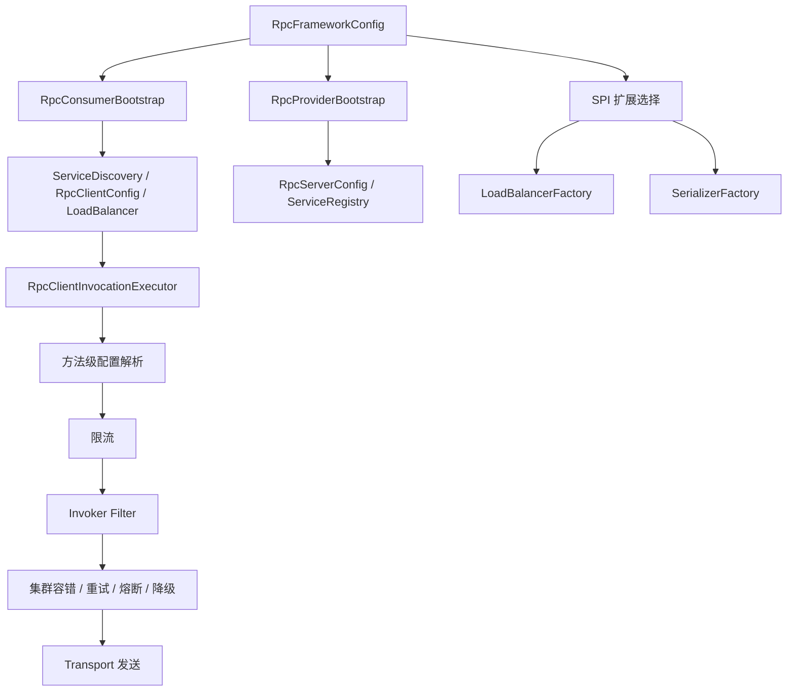

# 配置、扩展与治理：这些能力是怎么插进主链路的

## 1. 为什么这一篇会让很多人第一次看时觉得乱

前面几篇你看的主线还比较像“故事”：

- consumer 注入代理
- 代理构造请求
- transport 发请求
- provider 执行方法

但一旦进入配置、SPI 扩展、限流、熔断、降级、重试这些内容，很多小白会瞬间失去主线感。

原因通常不是内容本身太难，而是没有先搞清楚这些东西的地位：

`它们不是主线本身，它们是插在主线上的调节器和扩展点。`

所以这篇不会把这些内容讲成一堆零散特性，而是始终围绕一个问题：

`这些能力分别插在主链路的哪一步，它们解决什么问题。`

---

## 2. 先看总配置长什么样

项目的总配置对象是 `RpcFrameworkConfig`：

```java
@Data
public class RpcFrameworkConfig {
    private TransportType transportType = TransportType.NETTY;
    private String serializer = "protobuf";
    private String loadBalancer = "random";

    private RegistryType registryType = RegistryType.ZOOKEEPER;
    private String registryAddress = "127.0.0.1:2181";
    private int registryTimeout = 5000;

    private String serverHost = "127.0.0.1";
    private int serverPort = 8080;
    private List<String> serverScanPackages = new ArrayList<>();
    private boolean serverAutoRegisterAnnotatedServices = true;

    private int connectTimeout = 5000;
    private int readTimeout = 10000;
    private int heartbeatInterval = 30000;
    private int retryTimes = 3;
    private ClusterStrategy clusterStrategy = ClusterStrategy.FAIL_OVER;
    private List<MethodConfig> methodConfigs = new ArrayList<>();

    private boolean enableDegradation = false;
    private int degradationFailureThreshold = 10;
    private boolean rateLimitEnabled = false;
    private int rateLimitPermitsPerSecond = 100;
    private float circuitBreakerFailureRateThreshold = 50.0f;
    private int circuitBreakerMinNumberOfCalls = 10;
    private long circuitBreakerWaitDurationInOpenStateMillis = 30000L;
    private int circuitBreakerPermittedHalfOpenCalls = 5;
}
```

第一眼看这段代码时，不要急着去背每一个字段。

你应该先把它们按类别归类。

### 第一类：基础通信配置

- `transportType`
- `serializer`
- `registryType`
- `registryAddress`

### 第二类：provider 侧服务端配置

- `serverHost`
- `serverPort`
- `serverScanPackages`
- 线程池相关配置

### 第三类：consumer 侧调用配置

- `connectTimeout`
- `readTimeout`
- `heartbeatInterval`
- `retryTimes`
- `clusterStrategy`
- `methodConfigs`

### 第四类：治理配置

- 限流
- 熔断
- 降级
- 失败阈值

你一旦先按“类别”看配置，就不会被几十个字段吓住。

---

## 3. 配置真正在哪里进入 consumer 主线

看 `RpcConsumerBootstrap.fromConfig(...)`：

```java
public static RpcConsumerBootstrap fromConfig(RpcFrameworkConfig frameworkConfig) {
    DegradationPolicy degradationPolicy = DegradationPolicyFactory.create(
            frameworkConfig.getConsumerDegradationPolicy(),
            frameworkConfig.getConsumerDegradationDefaultValues()
    );
    FilterManager.configure(frameworkConfig);
    FilterRuntimeConfigurator.configureConsumer(frameworkConfig, degradationPolicy);

    ServiceDiscovery serviceDiscovery = ServiceRegistryFactory.createDiscovery(frameworkConfig);
    RpcClientConfig clientConfig = RpcClientConfig.builder()
            .transportType(frameworkConfig.getTransportType())
            .connectTimeout(frameworkConfig.getConnectTimeout())
            .readTimeout(frameworkConfig.getReadTimeout())
            .heartbeatInterval(frameworkConfig.getHeartbeatInterval())
            .retryTimes(frameworkConfig.getRetryTimes())
            .clusterStrategy(frameworkConfig.getClusterStrategy())
            .methodConfigs(frameworkConfig.getMethodConfigs())
            .loadBalancer(LoadBalancerFactory.getLoadBalancer(frameworkConfig.getLoadBalancer()))
            .serializerName(frameworkConfig.getSerializer())
            .build();

    RpcTransport rpcTransport = RpcTransportFactory.create(clientConfig, serviceDiscovery);
    return new RpcConsumerBootstrap(serviceDiscovery, rpcTransport);
}
```

这段代码说明：

consumer 不是在“真正发请求的那一刻”才临时读取配置，而是在 bootstrap 阶段就把大量配置装配进去了。

也就是说，配置并不是散落在每个角落，而是先经过启动装配，再进入后续调用链。

---

## 4. 配置真正在哪里进入 provider 主线

provider 侧对应的是：

```java
public static RpcProviderBootstrap fromConfig(RpcFrameworkConfig frameworkConfig) {
    DegradationPolicy degradationPolicy = DegradationPolicyFactory.create(
            frameworkConfig.getServerDegradationPolicy(),
            frameworkConfig.getServerDegradationDefaultValues()
    );
    FilterManager.configure(frameworkConfig);
    FilterRuntimeConfigurator.configureProvider(frameworkConfig, degradationPolicy);

    ServiceRegistry serviceRegistry = ServiceRegistryFactory.create(frameworkConfig);
    RpcServerConfig serverConfig = RpcServerConfig.custom()
            .transportType(frameworkConfig.getTransportType())
            .host(frameworkConfig.getServerHost())
            .port(frameworkConfig.getServerPort())
            .bossThreads(frameworkConfig.getBossThreads())
            .workerThreads(frameworkConfig.getWorkerThreads())
            .bizCoreThreads(frameworkConfig.getBizCoreThreads())
            .bizMaxThreads(frameworkConfig.getBizMaxThreads())
            .bizQueueCapacity(frameworkConfig.getBizQueueCapacity())
            .shutdownTimeout(frameworkConfig.getShutdownTimeout())
            .build();
    RpcServer rpcServer = RpcServerFactory.create(serverConfig, serviceRegistry);
    return new RpcProviderBootstrap(serviceRegistry, rpcServer, frameworkConfig);
}
```

这说明 provider 端配置主要影响的是：

- 服务端网络监听行为
- 线程池行为
- 服务暴露行为
- provider 侧过滤器和治理能力

所以 provider 和 consumer 虽然共用一个总配置对象，但实际消费配置的方式并不相同。

---

## 5. 为什么项目里要有 SPI 扩展机制

到目前为止，你已经见过至少三类“可替换能力”：

- 负载均衡器
- 序列化器
- 可能还有其他扩展点

如果这些实现都写死在代码里，比如永远只能用一种序列化方式、只能用一种负载均衡策略，那框架就很难扩展。

所以项目引入了 SPI 风格的扩展机制。

入口门面是 `ExtensionFactory`：

```java
public class ExtensionFactory {
    private static final Map<Class<?>, Object> DEFAULT_EXTENSIONS = new ConcurrentHashMap<>();

    @SuppressWarnings("unchecked")
    public static <T> T getDefaultExtension(Class<T> type) {
        return (T) DEFAULT_EXTENSIONS.computeIfAbsent(type, t -> {
            ExtensionLoader<T> loader = ExtensionLoader.getExtensionLoader(type);
            return loader.getDefaultExtension();
        });
    }

    public static <T> T getExtension(Class<T> type, String name) {
        ExtensionLoader<T> loader = ExtensionLoader.getExtensionLoader(type);
        return loader.getExtension(name);
    }
}
```

你可以先把它理解成：

`根据扩展类型和名字，从扩展系统里取实现。`

比如：

- 取默认序列化器
- 取名为 `random` 的负载均衡器
- 取名为 `protobuf` 的序列化器

这样项目就从“写死实现”变成了“按配置选实现”。

---

## 6. 负载均衡扩展是怎么接进来的

看 `LoadBalancerFactory`：

```java
public class LoadBalancerFactory {
    public static LoadBalancer getDefaultLoadBalancer() {
        return ExtensionFactory.getDefaultExtension(LoadBalancer.class);
    }

    public static LoadBalancer getLoadBalancer(String name) {
        if (name == null || name.isEmpty()) {
            return getDefaultLoadBalancer();
        }
        return ExtensionFactory.getExtension(LoadBalancer.class, name);
    }
}
```

这段代码很直白。

它的意义是：

`负载均衡策略不是写死在服务解析器里的，而是先通过扩展工厂按名字取出来，再交给调用链使用。`

然后在 consumer bootstrap 里：

```java
.loadBalancer(LoadBalancerFactory.getLoadBalancer(frameworkConfig.getLoadBalancer()))
```

这样配置值 `random` 就能最终变成一个真实负载均衡器对象。

这就是“配置 -> SPI 扩展 -> 主链路生效”的第一条典型路径。

---

## 7. 序列化扩展是怎么接进来的

看 `SerializerFactory`：

```java
public class SerializerFactory {
    private static final Map<Integer, String> SERIALIZER_NAME_BY_TYPE = new ConcurrentHashMap<>();
    private static final Map<Integer, Serializer> SERIALIZER_CACHE_BY_TYPE = new ConcurrentHashMap<>();

    public static Serializer getSerializer(int type) {
        String name = SERIALIZER_NAME_BY_TYPE.get(type);
        if (name == null) {
            return getDefaultSerializer();
        }
        return SERIALIZER_CACHE_BY_TYPE.computeIfAbsent(type, ignored -> getSerializer(name));
    }

    public static Serializer getDefaultSerializer() {
        return ExtensionFactory.getDefaultExtension(Serializer.class);
    }

    public static Serializer getSerializer(String name) {
        return ExtensionFactory.getExtension(Serializer.class, name);
    }
}
```

这段代码要抓住两个入口：

### 7.1 按名称拿序列化器

用于配置或方法级覆盖场景，例如：

```java
SerializerFactory.getSerializer("protobuf")
```

### 7.2 按类型码拿序列化器

用于协议解码阶段，因为消息头里通常是数值型 `serializerType`。

这也是为什么协议层和扩展层能对接起来：

- 配置阶段通常按名字表达
- 网络消息头里通常按类型码表达

`SerializerFactory` 正好桥接了这两种表达方式。

---

## 8. 为什么这些扩展不是直接在业务代码里选

你可能会想：

`业务代码直接 new 一个 RandomLoadBalancer 不就行了？`

表面上可以，但问题很快就会出现：

1. 业务代码和框架实现强耦合
2. 更换策略要改业务代码
3. 很难做到统一配置
4. 很难做到不同环境切换

而当前项目的做法是：

- 配置只表达“我要什么策略”
- 工厂只负责“把这个策略名变成对象”
- 主链路只消费接口能力，不关心具体实现类是谁

这就是典型的“面向扩展点编程”。

---

## 9. 治理能力首先插在 consumer 调用编排里

前面看过 `RpcClientInvocationExecutor.execute(...)`，这里再重点看一遍：

```java
public RpcResponse execute(RpcRequest rpcRequest, RpcTransportInvoker transportInvoker) throws Exception {
    InvocationOptions options = invocationOptionsResolver.resolve(rpcRequest);
    String rateLimitKey = resolveRateLimitKey(rpcRequest, options);
    if (rateLimiterManager != null
            && options.isRateLimitEnabled()
            && !rateLimiterManager.tryAcquire(rateLimitKey, options.getRateLimitPermitsPerSecond())) {
        return RpcResponse.fail(
                ErrorCode.RATE_LIMIT_EXCEEDED.getCode(),
                ErrorCode.RATE_LIMIT_EXCEEDED.getDescription(),
                rpcRequest.getRequestId()
        );
    }
    applyInvocationOptions(rpcRequest, options);
    FilterContext context = FilterContext.builder()
            .request(rpcRequest)
            .invocationOptions(options)
            .build();

    return (RpcResponse) new DefaultFilterChain(
            FilterManager.getFilters(FilterPhase.INVOKER),
            filterContext -> invokeWithCluster(filterContext.getRequest(), transportInvoker, options)
    ).proceed(context);
}
```

这段代码说明 consumer 侧治理能力主要插在两个位置：

### 9.1 发送前限流

```java
!rateLimiterManager.tryAcquire(...)
```

如果限流不通过，调用甚至不会往网络层走。

### 9.2 invoker 阶段过滤器

```java
FilterManager.getFilters(FilterPhase.INVOKER)
```

适合挂更靠近完整调用语义的治理逻辑，比如熔断、降级、统计。

所以治理能力不是独立于主链路之外的“附加模块”，它们是插在主链路关键位置上的控制点。

---

## 10. 方法级配置为什么重要

前面一直提到 `InvocationOptionsResolver` 和 `methodConfigs`。

这说明当前项目不是只有全局配置。

为什么要有方法级配置？

因为现实里不同方法对调用策略的要求往往不同。

比如：

- 查询接口可以适当重试
- 扣款接口可能不适合重试
- 某些高频接口需要更严格限流
- 某些轻量方法可以用更短超时

所以项目先把这些“方法级差异”解析成 `InvocationOptions`，再作用到这次具体调用上。

你在 `applyInvocationOptions(...)` 里已经看到了这个设计：

```java
if (options.getReadTimeout() != null) {
    rpcRequest.getAttachments().put(InvocationAttachmentKeys.READ_TIMEOUT, String.valueOf(options.getReadTimeout()));
}
if (options.getSerializerName() != null && !options.getSerializerName().isBlank()) {
    rpcRequest.getAttachments().put(InvocationAttachmentKeys.SERIALIZER, options.getSerializerName());
}
if (options.getLoadBalancerName() != null && !options.getLoadBalancerName().isBlank()) {
    rpcRequest.getAttachments().put(InvocationAttachmentKeys.LOAD_BALANCER, options.getLoadBalancerName());
}
```

也就是说，方法级配置最后不是停留在配置对象里，而是被折叠成了这次请求的一部分。

---

## 11. 重试是怎么工作的

重试核心在 `RetryExecutor`：

```java
public RpcResponse executeWithRetry(RpcRequest request,
                                    Callable<RpcResponse> callable,
                                    int maxRetriesOverride) throws Exception {
    int retryCount = 0;
    while (true) {
        try {
            return callable.call();
        } catch (RpcException e) {
            if (!retryStrategy.shouldRetry(e, retryCount, maxRetriesOverride)) {
                throw e;
            }
            retryCount++;
            TimeUnit.MILLISECONDS.sleep(retryStrategy.getDelay(retryCount));
        } catch (Exception e) {
            RpcException wrapped = new RpcException(ErrorCode.SERVER_ERROR, "Unknown rpc invoke error", e);
            if (!retryStrategy.shouldRetry(wrapped, retryCount, maxRetriesOverride)) {
                throw e;
            }
            retryCount++;
            TimeUnit.MILLISECONDS.sleep(retryStrategy.getDelay(retryCount));
        }
    }
}
```

这段代码建议你重点理解两点。

### 11.1 重试是“调用级”能力

它围绕的是一次业务请求是否要再尝试一次，而不是底层连接是否断开。

### 11.2 重试是否发生，取决于策略

不是所有异常都要重试，也不是无限重试。

要看：

- 当前异常类型
- 当前已重试次数
- 最大允许次数
- 重试策略返回的判断结果

所以“重试”不是一条简单的 `catch -> 再来一次`，而是受策略控制的调用治理能力。

---

## 12. 熔断和实例健康状态为什么放在调用执行器附近

在 `invokeOnce(...)` 中有这样的代码：

```java
CircuitBreaker instanceCircuitBreaker = circuitBreakerManager.getInstanceCircuitBreaker(
        rpcRequest.getServiceName(), address);
instanceCircuitBreaker.recordSuccess();
```

这说明熔断器关心的是“某次调用对某个实例的健康反馈”。

为什么它适合放在调用执行器附近？

因为这里正好掌握：

- 当前调用的是哪个服务
- 当前选中了哪个地址
- 这次调用成功还是失败

这些信息对于熔断判断是最关键的。

如果把熔断逻辑塞到代理层，拿不到具体地址；如果塞到纯网络层，又缺少更高层的调用语义。

所以调用执行器附近是非常合理的位置。

---

## 13. 降级能力在整个链路里扮演什么角色

在 bootstrap 阶段可以看到：

```java
DegradationPolicy degradationPolicy = DegradationPolicyFactory.create(
        frameworkConfig.getConsumerDegradationPolicy(),
        frameworkConfig.getConsumerDegradationDefaultValues()
);
FilterRuntimeConfigurator.configureConsumer(frameworkConfig, degradationPolicy);
```

provider 侧也有类似配置：

```java
DegradationPolicy degradationPolicy = DegradationPolicyFactory.create(
        frameworkConfig.getServerDegradationPolicy(),
        frameworkConfig.getServerDegradationDefaultValues()
);
FilterRuntimeConfigurator.configureProvider(frameworkConfig, degradationPolicy);
```

你可以先把降级理解成：

`当主调用链无法正常提供服务时，返回一个可接受的兜底结果，而不是直接把失败原样抛给上层。`

它通常不会替代主流程，而是作为失败后的兜底策略存在。

这也是为什么它常常通过过滤器运行时配置插入链路，而不是直接写死在核心调用代码里。

---

## 14. 一张“配置与治理插入点”图



这张图的重点不是记住每个类名，而是看见：

- 配置先进入 bootstrap
- SPI 把配置值变成真实实现
- 治理能力再插进调用链关键位置

---

## 15. 对小白来说，这一篇最重要的结论是什么

不是每个配置项都要现在背下来。

真正重要的是理解以下 5 个结论。

### 15.1 配置首先在 bootstrap 阶段进入系统

不是等调用发生时临时拼装。

### 15.2 SPI 扩展负责把“名字”变成“实现对象”

比如 `random` 变成负载均衡器，`protobuf` 变成序列化器。

### 15.3 治理能力不是孤立模块，而是插在主链路关键位置

限流、熔断、重试、降级都不是飘在系统外面。

### 15.4 方法级配置让不同方法可以使用不同调用策略

这是框架从“能用”走向“可精细控制”的关键一步。

### 15.5 重试和重连不是一回事

- 重试：重新发起一次调用
- 重连：恢复底层连接

这两个概念一定不能混。

---

## 16. 下一篇看什么

下一篇是 `06-protocol-and-transport-story.md`。

到这里，你已经知道：

- 调用是怎么被组织起来的
- 配置和扩展是怎么插进去的
- 治理能力是怎么作用到调用上的

下一篇要解决的问题是：

`RpcRequest 到底是怎样变成字节，通过网络发出去，再在另一端恢复成对象的。`

---

## 17. 本篇源码定位

建议重点对照这些文件：

- `rpc-core/src/main/java/com/rpc/core/config/RpcFrameworkConfig.java`
- `rpc-core/src/main/java/com/rpc/core/api/bootstrap/RpcConsumerBootstrap.java`
- `rpc-core/src/main/java/com/rpc/core/api/bootstrap/RpcProviderBootstrap.java`
- `rpc-core/src/main/java/com/rpc/core/extension/spi/ExtensionFactory.java`
- `rpc-core/src/main/java/com/rpc/core/extension/loadbalance/factory/LoadBalancerFactory.java`
- `rpc-core/src/main/java/com/rpc/core/extension/serialize/factory/SerializerFactory.java`
- `rpc-core/src/main/java/com/rpc/core/resilience/retry/RetryExecutor.java`
- `rpc-core/src/main/java/com/rpc/core/transport/netty/client/invocation/RpcClientInvocationExecutor.java`
