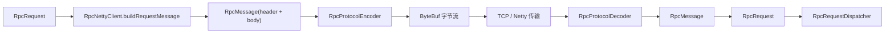
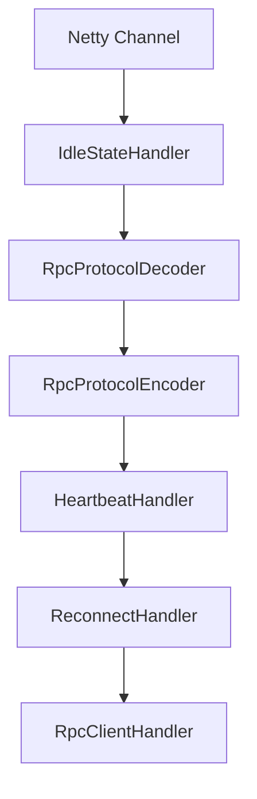

# 协议与传输：请求到底是怎么在网络里跑起来的

## 1. 为什么这一篇必须单独拿出来讲

前面几篇你已经知道：

- consumer 侧会构造 `RpcRequest`
- provider 侧会执行 `HelloServiceImpl`

但这里还有一个巨大空白：

`中间那段路到底怎么走的？`

也就是：

- `RpcRequest` 怎么变成网络消息
- 网络消息怎么编码成字节
- 字节怎么通过 Netty 发出去
- 对端怎么解码回来
- 响应又怎么再走一遍反向流程

这部分如果不讲清楚，整个 RPC 项目就会在你脑子里断成两截：

- 前半截是“框架会构造请求”
- 后半截是“服务端会执行业务”

中间网络真正发生的事情仍然是模糊的。

所以这篇的任务，就是把这一段补齐。

---

## 2. 先分清“协议”和“传输”不是一个东西

这是小白最容易混的地方之一。

### 协议层解决什么问题

`消息长什么样。`

也就是：

- 头里有哪些字段
- 消息体怎么组织
- 用什么序列化方式
- 怎么区分请求、响应、心跳

### 传输层解决什么问题

`消息怎么发出去。`

也就是：

- 连接怎么建立
- 请求怎么写入 Channel
- 响应怎么异步接收
- 超时怎么等待
- 连接池怎么复用

一句话记忆：

- 协议层回答“格式”
- 传输层回答“通道”

---

## 3. 请求在真正发出前是什么形态

在 consumer 侧调用编排完成后，transport 层会把 `RpcRequest` 包装成 `RpcMessage`。

关键代码在 `RpcNettyClient.buildRequestMessage(...)`：

```java
private RpcMessage buildRequestMessage(RpcRequest rpcRequest, long requestId) {
    byte requestSerializerType = resolveSerializerType(rpcRequest);
    RpcHeader header = RpcHeader.builder()
            .magicNumber(RpcHeader.MAGIC_NUMBER)
            .version(RpcHeader.VERSION)
            .serializerType(requestSerializerType)
            .messageType(RpcMessageType.REQUEST.getCode())
            .reserved((byte) 0)
            .requestId(requestId)
            .build();

    RpcMessage message = new RpcMessage();
    message.setHeader(header);
    message.setBody(rpcRequest);
    return message;
}
```

这里体现出两层模型：

- `RpcRequest`：业务请求模型
- `RpcMessage`：协议消息模型

为什么不能直接把 `RpcRequest` 丢给网络层？

因为网络层需要的不只是业务参数，还需要协议元信息，比如：

- 魔数
- 版本号
- 序列化方式
- 消息类型
- 请求 ID

这些信息都属于协议头的范畴。

---

## 4. 协议头里到底有什么

看 `RpcHeader`：

```java
@Data
@Builder
@AllArgsConstructor
@NoArgsConstructor
public class RpcHeader {
    @Builder.Default
    private int magicNumber = 0x12345678;

    @Builder.Default
    private byte version = 1;

    private byte serializerType;

    private byte messageType;

    private byte reserved;

    private long requestId;

    private int bodyLength;

    private long checksum;

    public static final int HEADER_LENGTH = 24;

    public static final int MAGIC_NUMBER = 0x12345678;

    public static final byte VERSION = 1;
}
```

这几个字段你不用死记硬背，但要知道它们分别解决什么问题。

### 4.1 `magicNumber`

用来快速识别“这是不是当前 RPC 协议的消息”。

如果收到的数据不是本协议格式，可以尽早拒绝。

### 4.2 `version`

用来做协议版本控制。

以后协议升级时，这个字段很重要。

### 4.3 `serializerType`

告诉接收方该用哪种序列化器解析消息体。

### 4.4 `messageType`

区分：

- 普通请求
- 普通响应
- 心跳请求
- 心跳响应

### 4.5 `requestId`

让请求和响应可以对应起来。

### 4.6 `bodyLength`

告诉解码器消息体有多长，便于处理拆包粘包。

### 4.7 `checksum`

用于校验消息体是否损坏。

这几个字段放一起，就是一份标准的协议头。

---

## 5. 为什么协议头里一定要带 `serializerType`

这个点非常重要。

当前项目支持 SPI 序列化扩展，意味着同一套 RPC 框架理论上可以支持多种序列化器。

那接收方在解码时怎么知道该用哪一种？

答案就是：

`发送方在消息头里明确写出 serializerType。`

你在 `buildRequestMessage(...)` 和编码器里都能看到这个设计。

这使得协议层与序列化扩展机制真正打通了。

---

## 6. 编码器是怎么把消息写成字节的

看 `RpcProtocolEncoder.encode(...)`：

```java
@Override
public void encode(ChannelHandlerContext ctx, RpcMessage msg, ByteBuf out) throws Exception {
    RpcHeader header = msg.getHeader();
    Object body = msg.getBody();

    Serializer serializer = SerializerFactory.getSerializer(header.getSerializerType());
    byte[] bodyBytes = serializer.serialize(body);

    header.setBodyLength(bodyBytes.length);

    CRC32 crc32 = new CRC32();
    crc32.update(bodyBytes);
    header.setChecksum(crc32.getValue());

    out.writeInt(header.getMagicNumber());
    out.writeByte(header.getVersion());
    out.writeByte(header.getSerializerType());
    out.writeByte(header.getMessageType());
    out.writeByte(header.getReserved());
    out.writeLong(header.getRequestId());
    out.writeInt((int) header.getChecksum());
    out.writeInt(header.getBodyLength());
    out.writeBytes(bodyBytes);
}
```

这段代码的顺序非常关键。

### 第一步：按 `serializerType` 选择序列化器

```java
Serializer serializer = SerializerFactory.getSerializer(header.getSerializerType());
```

### 第二步：把消息体对象序列化成字节数组

```java
byte[] bodyBytes = serializer.serialize(body);
```

### 第三步：把消息体长度和校验和写回头部

```java
header.setBodyLength(bodyBytes.length);
header.setChecksum(crc32.getValue());
```

### 第四步：严格按固定顺序把头字段和消息体写入字节流

```java
out.writeInt(...)
out.writeByte(...)
out.writeLong(...)
out.writeBytes(bodyBytes)
```

这里你要记住一个非常重要的协议原则：

`编码顺序和解码顺序必须完全一致。`

否则接收方读取出来的字段就会错位，整条消息都废掉。

---

## 7. 解码器是怎么把字节还原回消息的

看 `RpcProtocolDecoder.decode(...)`：

```java
@Override
protected Object decode(ChannelHandlerContext ctx, ByteBuf in) throws Exception {
    ByteBuf frame = (ByteBuf) super.decode(ctx, in);
    if (frame == null) {
        return null;
    }

    RpcHeader header = new RpcHeader();
    header.setMagicNumber(frame.readInt());
    header.setVersion(frame.readByte());
    header.setSerializerType(frame.readByte());
    header.setMessageType(frame.readByte());
    header.setReserved(frame.readByte());
    header.setRequestId(frame.readLong());
    header.setChecksum(frame.readUnsignedInt());
    header.setBodyLength(frame.readInt());

    int magicNumber = header.getMagicNumber();
    if (magicNumber != RpcHeader.MAGIC_NUMBER) {
        frame.release();
        throw new IllegalArgumentException("Invalid RPC magic number: " + Integer.toHexString(magicNumber));
    }

    byte version = header.getVersion();
    if (version != RpcHeader.VERSION) {
        frame.release();
        throw new UnsupportedOperationException(
                "Unsupported RPC protocol version " + version + ", expected " + RpcHeader.VERSION);
    }

    byte[] bodyBytes = new byte[header.getBodyLength()];
    frame.readBytes(bodyBytes, 0, header.getBodyLength());

    CRC32 crc32 = new CRC32();
    crc32.update(bodyBytes);
    long calculatedChecksum = crc32.getValue();
    if (calculatedChecksum != header.getChecksum()) {
        frame.release();
        throw new IOException("Invalid RPC checksum: expected " + header.getChecksum()
                + ", actual " + calculatedChecksum);
    }

    Serializer serializer = SerializerFactory.getSerializer(header.getSerializerType());
    Object body = deserializeBody(serializer, bodyBytes, header.getMessageType());

    frame.release();

    RpcMessage message = new RpcMessage();
    message.setHeader(header);
    message.setBody(body);
    return message;
}
```

这段代码的关键动作也很清楚。

### 7.1 先让父类帮你切出完整帧

```java
ByteBuf frame = (ByteBuf) super.decode(ctx, in);
```

这一步利用的是 `LengthFieldBasedFrameDecoder`，它能帮助解决拆包粘包问题。

### 7.2 按固定顺序读取头部字段

顺序必须和编码器一模一样。

### 7.3 校验魔数和版本号

如果不是本协议或者版本不支持，就尽早失败。

### 7.4 读取消息体字节并校验 checksum

这样可以尽快发现传输损坏。

### 7.5 根据 `serializerType` 和 `messageType` 反序列化

这一步又把协议层和扩展层接到了一起。

---

## 8. 为什么解码器要继承 `LengthFieldBasedFrameDecoder`

看构造函数：

```java
public RpcProtocolDecoder() {
    super(1024 * 1024, 20, 4, 0, 0);
}
```

你现在不用马上把这几个数字全背下来，但要知道它解决了什么问题：

`TCP 是字节流，不保证一次 read 就对应一条完整消息。`

这就会产生：

- 拆包：一条消息被分成多次到达
- 粘包：多条消息粘在一起到达

而当前协议头里有 `bodyLength` 字段，所以可以直接利用 Netty 提供的长度字段解码器，先把完整一帧切出来，再做后续字段解析。

这是很标准也很实用的做法。

---

## 9. messageType 为什么也很关键

解码阶段除了 `serializerType`，还要看 `messageType`：

```java
private Object deserializeBody(Serializer serializer, byte[] bodyBytes, byte messageType) throws IOException {
    if (messageType == RpcMessageType.REQUEST.getCode()) {
        return serializer.deserialize(bodyBytes, RpcRequest.class);
    }
    if (messageType == RpcMessageType.RESPONSE.getCode()) {
        return serializer.deserialize(bodyBytes, RpcResponse.class);
    }
    if (messageType == RpcMessageType.HEARTBEAT_REQUEST.getCode()
            || messageType == RpcMessageType.HEARTBEAT_RESPONSE.getCode()) {
        return serializer.deserialize(bodyBytes, RpcHeartbeat.class);
    }
    return serializer.deserialize(bodyBytes, Object.class);
}
```

这里体现了协议层的另一个核心职责：

`不仅要知道怎么反序列化，还要知道该反序列化成哪种消息模型。`

同样是字节数组，如果 messageType 不同，目标类型就不同。

所以 messageType 不只是“分类标签”，它直接影响解码结果。

---

## 10. 真正负责建立连接和发送消息的是谁

协议层解决的是格式问题，传输层解决的是连接和发送问题。

当前项目中，Netty 客户端核心实现是 `RpcNettyClient`。

它的构造函数里会初始化 Netty Bootstrap：

```java
Bootstrap bootstrap = new Bootstrap();
bootstrap.group(eventLoopGroup)
        .channel(NioSocketChannel.class)
        .option(ChannelOption.CONNECT_TIMEOUT_MILLIS, config.getConnectTimeout())
        .option(ChannelOption.TCP_NODELAY, true)
        .handler(new LoggingHandler(LogLevel.INFO))
        .handler(new ChannelInitializer<SocketChannel>() {
            @Override
            protected void initChannel(SocketChannel ch) {
                ch.pipeline()
                        .addLast("idleStateHandler",
                                new IdleStateHandler(0, config.getHeartbeatInterval(), 0, TimeUnit.MILLISECONDS))
                        .addLast("decoder", new RpcProtocolDecoder())
                        .addLast("encoder", new RpcProtocolEncoder())
                        .addLast("heartbeatHandler", new HeartbeatHandler())
                        .addLast("reconnectHandler", new ReconnectHandler(connectionPool, closing, config))
                        .addLast("handler", new RpcClientHandler(requestManager));
            }
        });
```

这里最值得看的不是 Netty 语法本身，而是 pipeline 的顺序。

---

## 11. pipeline 顺序为什么不能乱

当前 pipeline 大致是：

1. `IdleStateHandler`
2. `RpcProtocolDecoder`
3. `RpcProtocolEncoder`
4. `HeartbeatHandler`
5. `ReconnectHandler`
6. `RpcClientHandler`

这说明客户端连接里会经过这些阶段：

- 空闲检测
- 协议解码
- 协议编码
- 心跳处理
- 重连处理
- 普通业务响应处理

为什么顺序很重要？

因为 pipeline 不是一个无序容器，而是一条处理链。

比如：

- 如果没有先解码，后面的 handler 很难直接处理原始字节流
- 如果心跳逻辑和普通响应逻辑不区分，代码会变乱
- 如果没有空闲检测，心跳就没法自然触发

所以这条 pipeline 其实就是 transport 层的“内部主线图”。

---

## 12. 同步请求为什么底层仍然是异步模型

`RpcNettyClient.sendRequestToAddress(...)` 再看一次：

```java
private RpcResponse sendRequestToAddress(RpcRequest rpcRequest, InetSocketAddress address) throws Exception {
    long requestId = generateRequestId();
    rpcRequest.setRequestId(String.valueOf(requestId));
    CompletableFuture<RpcResponse> future = requestManager.addRequest(requestId);

    RpcConnection connection = connectionPool.getConnection(address.getHostString(), address.getPort());
    RpcMessage message = buildRequestMessage(rpcRequest, requestId);

    connection.getChannel().writeAndFlush(message).sync();
    return future.get(resolveReadTimeout(rpcRequest), TimeUnit.MILLISECONDS);
}
```

业务代码看起来像同步调用：

```java
String result = helloService.sayHello("consumer");
```

但底层网络其实是：

1. 异步发送消息
2. 异步接收响应
3. 通过 `requestId -> future` 映射把它重新包装成“同步等待结果”的效果

所以你可以把当前项目理解成：

`对上层暴露同步调用体验，对底层采用异步网络实现。`

这是一种很常见的 RPC 设计。

---

## 13. 为什么需要连接池

发送请求时会这样取连接：

```java
RpcConnection connection = connectionPool.getConnection(address.getHostString(), address.getPort());
```

这说明 transport 层不会每次调用都重新建立 TCP 连接。

如果每次调用都重新建连，会有这些问题：

- 握手开销大
- 延迟高
- 吞吐低
- 资源浪费严重

所以连接池负责把已有连接复用起来，提高调用效率。

对于 RPC 项目来说，这几乎是基础能力。

---

## 14. 心跳和重连为什么属于 transport 层

在 pipeline 中你已经看到：

- `HeartbeatHandler`
- `ReconnectHandler`

它们都更偏底层连接管理，而不是业务调用编排。

### 心跳解决什么问题

- 长连接保活
- 及时发现对端不可达
- 给连接健康探测提供依据

### 重连解决什么问题

- 底层连接异常断开后尝试恢复通道

所以心跳和重连更像 transport 的“连接生命周期管理”，而不是业务层策略。

这也再次说明：

- 请求重试属于调用治理
- 连接重连属于传输恢复

两者不要混。

---

## 15. 一张“请求变字节，字节再变回请求”的图



如果这张图你能在脑子里顺着走一遍，协议和传输这块就已经不再抽象了。

---

## 16. provider 端为什么能用同样的协议头解析请求

因为当前协议是双向一致的。

也就是说：

- consumer 发送请求时按这套头部编码
- provider 接收请求时按同一套头部解码
- provider 返回响应时也按同一套协议头编码
- consumer 收到响应后再按同一套协议头解码

这就是为什么 `RpcHeader` 和编解码器是全链路共享基础设施，而不是 consumer/provider 各自一套。

---

## 17. 对小白来说，这一篇最重要的 7 个结论

### 17.1 `RpcRequest` 不直接上网络，先会被包装成 `RpcMessage`

因为网络层还需要协议头信息。

### 17.2 协议头解决的是识别、版本、类型、序列化、长度、校验等问题

它不是多余字段集合，而是消息格式的核心。

### 17.3 `serializerType` 让协议层和 SPI 序列化扩展真正连起来

这是多序列化支持的关键。

### 17.4 编码顺序和解码顺序必须完全一致

这属于协议实现最基本的纪律。

### 17.5 `LengthFieldBasedFrameDecoder` 用来解决拆包粘包

因为 TCP 只保证字节流，不保证消息边界。

### 17.6 transport 层负责连接、发送、接收、超时等待和连接复用

协议层不负责这些事。

### 17.7 同步 RPC 外观底层常常是异步网络实现

当前项目也是这样。

---

## 18. 一张 transport 内部 pipeline 图



这张图可以帮助你把 transport 层内部各个 handler 的位置感建立起来。

---

## 19. 到这里你应该可以把全项目主线重新串起来

现在你已经有能力用一段完整的人话把整个项目讲出来：

```text
Spring 在 consumer 端把 @RpcReference 字段注入成代理对象。
业务代码调用代理对象时，RpcInvocationHandler 会构造 RpcRequest。
调用执行器结合方法级配置、限流、负载均衡、重试和熔断，决定这次如何调用。
RpcNettyClient 把 RpcRequest 包装成带协议头的 RpcMessage，再经过编码器写成字节流，通过 Netty 发送出去。
provider 端收到字节流后，先经过解码器还原为 RpcMessage 和 RpcRequest。
RpcRequestDispatcher 根据消息类型分流，业务请求交给执行器根据本地注册表找到 HelloServiceImpl，再反射执行目标方法。
执行结果包装成 RpcResponse，再按同样协议编码后返回 consumer。
consumer 收到响应后根据 requestId 找到等待中的 future，最终把结果还给业务代码。
```

如果这段话你已经能顺下来，说明整套主线课程已经真正连起来了。

---

## 20. 本篇源码定位

建议重点对照这些文件：

- `rpc-core/src/main/java/com/rpc/core/protocol/RpcHeader.java`
- `rpc-core/src/main/java/com/rpc/core/protocol/codec/RpcProtocolEncoder.java`
- `rpc-core/src/main/java/com/rpc/core/protocol/codec/RpcProtocolDecoder.java`
- `rpc-core/src/main/java/com/rpc/core/transport/netty/client/RpcNettyClient.java`
- `rpc-core/src/main/java/com/rpc/core/transport/netty/server/dispatch/RpcRequestDispatcher.java`
