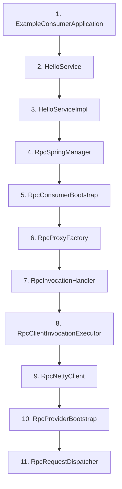

# 源码阅读顺序：第一遍怎么读才不会乱

## 1. 先说结论：看框架源码最怕的不是难，而是乱

很多人第一次打开框架项目源码，通常会这样开始：

1. 看到 `rpc-core`，觉得这里最核心，于是直接点进去
2. 看到包很多，不知道先看哪个
3. 随手点开一个看起来很“底层”的类，比如协议、Netty、注册中心
4. 看了几分钟以后发现类之间互相引用越来越多
5. 最后 IDE 开了一堆标签页，但主线并没有真正建立起来

这不是理解能力问题，主要是阅读顺序问题。

框架源码和业务源码不一样。

业务源码常常可以按目录或模块看，因为业务流程通常和目录组织比较接近。

但框架源码不是这样。框架源码往往有很多“支撑层”，这些支撑层单独看都能成立，但如果你一上来就扎进去，往往会失去方向。

所以第一遍看框架源码，最重要的不是“尽量多看”，而是：

`一定要按一条稳定主线去读。`

这篇文档就是专门解决这个问题的。

它不会试图一次覆盖所有类，而是给你一条：

`从业务入口出发，顺着一条最不容易迷路的路线，把整个项目主骨架走通。`

---

## 2. 第一遍读源码时，你的目标到底应该是什么

第一遍读源码时，目标不应该是：

1. 把所有类都读完
2. 把所有字段都背下来
3. 把 Netty / 注册中心 / 协议细节一次全部吃透
4. 把工具类、辅助类、SPI 细节都逐个摸一遍

如果你这样读，通常会出现两个结果：

1. 阅读很累
2. 收获很散

第一遍真正的目标应该更克制一点：

`把“这个项目是怎么跑起来的”这条主骨架顺下来。`

这里所谓的“主骨架”，不是包结构，也不是类继承结构，而是调用主线：

```text
业务代码从哪里发起调用
-> 框架怎么接住这次调用
-> 请求怎么被组织出来
-> 请求怎么被发出去
-> provider 怎么接住请求
-> 本地服务怎么被真正执行
-> 响应怎么回到业务代码
```

只要这条骨架打通了，后面你再去看：

- SPI 扩展
- 负载均衡
- 协议
- 传输
- 容错治理
- Spring 集成

就都会有位置。

如果这条骨架没打通，后面所有专题都只会显得像零散功能点。

---

## 3. 为什么这个项目必须按“调用链”读，而不是按“目录”读

当前仓库的模块结构本身没有问题，但对第一次阅读源码的人来说，如果你直接按目录扫，很容易出现理解断层。

因为目录是按职责拆的，而不是按一次调用顺序排的。

例如：

- `invoke` 里有代理和过滤器
- `transport` 里有 Netty client/server
- `protocol` 里有消息头和编解码器
- `registry` / `discovery` 里有注册和发现
- `spring` 里有容器集成

这些目录拆法对于工程实现很合理，但对第一次阅读的人来说并不天然友好。

因为真实阅读时你更想知道的是：

`当我写了 helloService.sayHello("consumer") 以后，接下来到底发生了什么。`

这本质上是按调用顺序的问题，而不是按目录归档的问题。

所以第一遍源码阅读，建议你采用下面这个原则：

`顺着“调用发生顺序”走，而不是顺着“目录组织顺序”走。`

---

## 4. 先给出完整的第一遍阅读顺序

下面这条顺序，是当前项目最适合小白第一遍走的路线：

1. `ExampleConsumerApplication`
2. `HelloService`
3. `HelloServiceImpl`
4. `RpcSpringManager`
5. `RpcConsumerBootstrap`
6. `RpcProxyFactory`
7. `RpcInvocationHandler`
8. `RpcClientInvocationExecutor`
9. `RpcNettyClient`
10. `RpcProviderBootstrap`
11. `RpcRequestDispatcher`

这 11 个类不是“最重要的全部类”，但它们是“第一遍最能把主线串起来的类”。

你现在先不要急着问：

- 为什么不是先看 `RpcHeader`
- 为什么不是先看注册中心
- 为什么不是先看过滤器

因为这些类虽然重要，但第一遍不适合作为入口。

第一遍最重要的是让你先有一条完整故事线。

---

## 5. 第一站：`ExampleConsumerApplication`

源码位置：
- `example-consumer/src/main/java/com/rpc/ExampleConsumerApplication.java`

核心代码：

```java
@Component
static class ConsumerRunner implements ApplicationRunner {
    @RpcReference
    private HelloService helloService;

    @Override
    public void run(ApplicationArguments args) {
        System.out.println(helloService.sayHello("consumer"));
        System.out.println("1 + 2 = " + helloService.add(1, 2));
    }
}
```

为什么第一站一定从这里开始？

因为这里离业务最近，阅读压力最低，但信息密度非常高。

你在这里第一次就能看到：

1. `@RpcReference`
2. `HelloService`
3. `helloService.sayHello(...)`
4. “看起来像本地调用”的使用方式

这能立刻把你带入最核心的问题：

`为什么一个看起来像本地方法调用的写法，最后会跑成一次远程调用？`

从阅读体验上说，这比一上来先看网络、协议、注册中心稳定得多。

你在这里要带着两个问题继续往后走：

1. `helloService` 为什么能被注入？
2. 它注入进去的到底是什么对象？

这两个问题会自然把你带到下一站。

---

## 6. 第二站：`HelloService`

源码位置：
- `example-api/src/main/java/com/rpc/HelloService.java`

核心代码：

```java
public interface HelloService {
    String sayHello(String name);

    String sayHi(String name);

    Integer add(Integer a, Integer b);
}
```

为什么第二站要插入接口层？

因为 RPC 项目里一个最容易被忽略但非常关键的事实是：

`consumer 和 provider 真正共享的是契约，不是实现类。`

`HelloService` 的价值不在于它复杂，而在于它把 consumer 和 provider 的关系讲得非常清楚：

- consumer 依赖接口
- provider 实现接口
- 框架围绕这个接口契约组织远程调用

所以你读这个类时，要刻意建立一个认知：

`RPC 调的不是某个具体实现类，而是接口代表的服务契约。`

这会帮你后面看代理、注册、服务名、方法名等内容时不跑偏。

---

## 7. 第三站：`HelloServiceImpl`

源码位置：
- `example-provider/src/main/java/com/rpc/HelloServiceImpl.java`

核心代码：

```java
@RpcService(HelloService.class)
public class HelloServiceImpl implements HelloService {
    @Override
    public String sayHello(String name) {
        return "Hello, " + name + "!";
    }

    @Override
    public Integer add(Integer a, Integer b) {
        return a + b;
    }
}
```

为什么要这么早看 provider 的实现类？

因为你要尽早知道整条调用链最终落点是什么。

RPC 框架中间可以非常复杂，但最终目标非常朴素：

`让远端的一次接口调用，最终变成 provider 本地的一次普通方法执行。`

所以你看这个类时，不是为了研究业务代码本身，而是为了明确：

`后面整条链路，最终要落到这里。`

也就是：

- consumer 调的是 `HelloService`
- provider 真正执行的是 `HelloServiceImpl`

这会让你的阅读从一开始就带着终点意识。

---

## 8. 第四站：`RpcSpringManager`

源码位置：
- `rpc-spring/src/main/java/com/rpc/spring/RpcSpringManager.java`

关键代码一：注入 `@RpcReference`

```java
@Override
public Object postProcessBeforeInitialization(Object bean, String beanName) throws BeansException {
    ReflectionUtils.doWithFields(bean.getClass(), field -> injectReference(bean, field), this::isRpcReferenceField);
    return bean;
}
```

关键代码二：真正执行注入

```java
private void injectReference(Object bean, Field field) {
    RpcReference rpcReference = field.getAnnotation(RpcReference.class);
    Class<?> serviceType = rpcReference.value() == Void.class ? field.getType() : rpcReference.value();
    Object proxy = getConsumerBootstrap().getService(serviceType);
    ReflectionUtils.makeAccessible(field);
    ReflectionUtils.setField(field, bean, proxy);
}
```

为什么第四站看它？

因为你在第一站已经明确感受到：

`helloService` 一定不是普通 Spring Bean 注入那么简单。`

`RpcSpringManager` 正好回答这个问题。

你在这里会第一次真正看到：

- `@RpcReference` 会被扫描
- 字段会被手动写入代理对象
- Spring 生命周期是框架接入点

所以你读这个类时，不要一开始就陷入 Spring 各种接口细节。

第一遍真正要抓住的只有一句话：

`它是 Spring 容器和 RPC 框架之间的接线员。`

同时，这个类也会让你自然继续追问：

`这个 proxy 到底是谁创建的？`

这会把你带到下一站。

---

## 9. 第五站：`RpcConsumerBootstrap`

源码位置：
- `rpc-core/src/main/java/com/rpc/core/api/bootstrap/RpcConsumerBootstrap.java`

关键代码：

```java
public static RpcConsumerBootstrap fromConfig(RpcFrameworkConfig frameworkConfig) {
    DegradationPolicy degradationPolicy = DegradationPolicyFactory.create(
            frameworkConfig.getConsumerDegradationPolicy(),
            frameworkConfig.getConsumerDegradationDefaultValues()
    );
    FilterManager.configure(frameworkConfig);
    FilterRuntimeConfigurator.configureConsumer(frameworkConfig, degradationPolicy);

    ServiceDiscovery serviceDiscovery = ServiceRegistryFactory.createDiscovery(frameworkConfig);
    RpcClientConfig clientConfig = RpcClientConfig.builder()
            .transportType(frameworkConfig.getTransportType())
            .connectTimeout(frameworkConfig.getConnectTimeout())
            .readTimeout(frameworkConfig.getReadTimeout())
            .retryTimes(frameworkConfig.getRetryTimes())
            .clusterStrategy(frameworkConfig.getClusterStrategy())
            .methodConfigs(frameworkConfig.getMethodConfigs())
            .loadBalancer(LoadBalancerFactory.getLoadBalancer(frameworkConfig.getLoadBalancer()))
            .serializerName(frameworkConfig.getSerializer())
            .build();

    RpcTransport rpcTransport = RpcTransportFactory.create(clientConfig, serviceDiscovery);
    return new RpcConsumerBootstrap(serviceDiscovery, rpcTransport);
}
```

还有：

```java
public <T> T getService(Class<T> serviceClass) {
    return proxyFactory.createProxyInstance(serviceClass);
}
```

为什么第五站看它？

因为这里是 consumer 侧“总装配入口”。

你在这里会第一次明确看到：

- 配置被读入
- 服务发现被创建
- transport 被创建
- 代理工厂被准备好

这说明 consumer 端不是“突然就会远程调用了”，而是先被完整组装好。

你第一遍读这个类时，不要被 builder 字段淹没。

更有价值的做法是只抓 3 个问题：

1. consumer 启动时到底装了哪些核心零件
2. `getService(...)` 为什么会返回代理对象
3. 这个 bootstrap 在整条 consumer 调用链里处于什么位置

你如果把这 3 个问题读清楚，就足够继续往后走。

---

## 10. 第六站：`RpcProxyFactory`

源码位置：
- `rpc-core/src/main/java/com/rpc/core/invoke/proxy/RpcProxyFactory.java`

关键代码：

```java
public <T> T createProxyInstance(Class<T> serviceClass) {
    if (serviceClass.isInterface()) {
        return createProxyBySDKInstance(serviceClass);
    }
    return createProxyByCGLibInstance(serviceClass);
}
```

```java
public <T> T createProxyBySDKInstance(Class<T> serviceClass) {
    return (T) Proxy.newProxyInstance(
            serviceClass.getClassLoader(),
            new Class<?>[]{serviceClass},
            new RpcInvocationHandler(serviceClass, requireClient())
    );
}
```

为什么这里必须单独看？

因为它会把一个非常关键但容易停留在概念层的事实，真正落实到代码上：

`业务代码拿到的服务对象，实际上是框架创建出来的代理对象。`

这不是抽象说法，而是具体代码就是这么干的。

同时你在这里还会看到：

- 接口优先使用 JDK 动态代理
- 非接口类才退回到 CGLIB

对第一次阅读来说，你不需要马上深入比较 JDK 代理和 CGLIB 的所有差异。

你真正要抓住的是：

`代理对象是远程调用的入口壳，RpcInvocationHandler 才是后面真正的接管点。`

所以下一站就非常自然了。

---

## 11. 第七站：`RpcInvocationHandler`

源码位置：
- `rpc-core/src/main/java/com/rpc/core/invoke/proxy/impl/RpcInvocationHandler.java`

关键代码：

```java
@Override
public Object invoke(Object proxy, Method method, Object[] args) throws Throwable {
    if (method.getDeclaringClass() == Object.class) {
        return method.invoke(this, args);
    }

    RpcContext rpcContext = RpcContext.create()
            .setRequestId(UUID.randomUUID().toString());

    try {
        RpcRequest request = RpcRequest.builder()
                .requestId(rpcContext.getRequestId())
                .serviceName(serviceClass.getName())
                .methodName(method.getName())
                .parameterTypes(method.getParameterTypes())
                .parameters(args)
                .returnType(method.getReturnType())
                .build();

        FilterContext context = FilterContext.builder()
                .rpcContext(rpcContext)
                .request(request)
                .serviceClass(serviceClass)
                .build();
        RpcResponse response = (RpcResponse) new DefaultFilterChain(
                FilterManager.getFilters(FilterPhase.CONSUMER),
                filterContext -> client.sendRequest(filterContext.getRequest())
        ).proceed(context);

        if (response.getCode() != null && response.getCode() == 200) {
            return response.getData();
        }
        throw new RuntimeException("RPC invoke failed: " + response.getMessage());
    } finally {
        RpcContext.clear();
    }
}
```

为什么这一站非常关键？

因为这里是“本地方法调用”和“远程请求语义”之间的转换点。

你必须真正看懂：

- 方法名怎么变成 `methodName`
- 参数怎么变成 `parameters`
- 接口名怎么变成 `serviceName`
- 返回值类型怎么变成 `returnType`

也就是说：

`helloService.sayHello("consumer")`

在这里被翻译成了：

`RpcRequest`

这是一道分水岭。

你如果把这段看明白，consumer 端的“魔法感”会明显下降。

同时，这里又会自然引出下一个问题：

`请求对象创建出来以后，具体是谁继续组织这次调用？`

---

## 12. 第八站：`RpcClientInvocationExecutor`

源码位置：
- `rpc-core/src/main/java/com/rpc/core/transport/netty/client/invocation/RpcClientInvocationExecutor.java`

关键代码一：调用总入口

```java
public RpcResponse execute(RpcRequest rpcRequest, RpcTransportInvoker transportInvoker) throws Exception {
    InvocationOptions options = invocationOptionsResolver.resolve(rpcRequest);
    String rateLimitKey = resolveRateLimitKey(rpcRequest, options);
    if (rateLimiterManager != null
            && options.isRateLimitEnabled()
            && !rateLimiterManager.tryAcquire(rateLimitKey, options.getRateLimitPermitsPerSecond())) {
        return RpcResponse.fail(...);
    }
    applyInvocationOptions(rpcRequest, options);
    FilterContext context = FilterContext.builder()
            .request(rpcRequest)
            .invocationOptions(options)
            .build();

    return (RpcResponse) new DefaultFilterChain(
            FilterManager.getFilters(FilterPhase.INVOKER),
            filterContext -> invokeWithCluster(filterContext.getRequest(), transportInvoker, options)
    ).proceed(context);
}
```

关键代码二：一次实际调用

```java
private Callable<RpcResponse> invokeOnce(RpcRequest rpcRequest,
                                         RpcTransportInvoker transportInvoker,
                                         InvocationOptions options) {
    return () -> {
        InetSocketAddress address = serviceResolver.resolve(
                rpcRequest.getServiceName(),
                options.getLoadBalancerName()
        );
        RpcResponse response = transportInvoker.invoke(rpcRequest, address);
        if (response.getCode() == null || response.getCode() != 200) {
            throw new RpcException(ErrorCode.SERVICE_EXCEPTION, "RPC invoke failed: " + response.getMessage());
        }
        return response;
    };
}
```

为什么它要排在这里看？

因为这是 consumer 侧的编排中心。

前面代理层只是把方法调用翻译成请求对象，并没有负责：

- 方法级配置
- 限流
- 过滤器
- 负载均衡
- 服务发现
- 重试
- 集群策略

这些事情都在这里开始聚合。

所以你看这个类时，要刻意建立一个认知：

`代理层负责入口翻译，调用执行器负责调用编排。`

这两者不能混。

一旦你把这两层的职责分开看，consumer 侧代码会清晰很多。

---

## 13. 第九站：`RpcNettyClient`

源码位置：
- `rpc-core/src/main/java/com/rpc/core/transport/netty/client/RpcNettyClient.java`

关键代码一：统一入口

```java
@Override
public RpcResponse sendRequest(RpcRequest rpcRequest) throws Exception {
    return invocationExecutor.execute(rpcRequest, this::sendRequestToAddress);
}
```

关键代码二：真正发到某个地址

```java
private RpcResponse sendRequestToAddress(RpcRequest rpcRequest, InetSocketAddress address) throws Exception {
    long requestId = generateRequestId();
    rpcRequest.setRequestId(String.valueOf(requestId));
    CompletableFuture<RpcResponse> future = requestManager.addRequest(requestId);

    RpcConnection connection = connectionPool.getConnection(address.getHostString(), address.getPort());
    RpcMessage message = buildRequestMessage(rpcRequest, requestId);

    connection.getChannel().writeAndFlush(message).sync();
    return future.get(resolveReadTimeout(rpcRequest), TimeUnit.MILLISECONDS);
}
```

关键代码三：Netty pipeline

```java
ch.pipeline()
        .addLast("idleStateHandler", new IdleStateHandler(...))
        .addLast("decoder", new RpcProtocolDecoder())
        .addLast("encoder", new RpcProtocolEncoder())
        .addLast("heartbeatHandler", new HeartbeatHandler())
        .addLast("reconnectHandler", new ReconnectHandler(connectionPool, closing, config))
        .addLast("handler", new RpcClientHandler(requestManager));
```

为什么这时候才看它？

因为如果你一上来就看 `RpcNettyClient`，很容易只看到 Netty 细节，反而不知道它处在主线哪一段。

但现在你已经知道：

- 请求从哪里来
- 调用执行器做了哪些组织
- 这时只剩下一个问题：怎么真正发出去

所以这时看 `RpcNettyClient` 就非常顺。

你在这里第一遍最该抓的是：

1. 调用执行器最终会回调到这里
2. 请求会被包装成 `RpcMessage`
3. 连接池、requestId、future、pipeline 在这里开始落地

不要一开始就深究 Netty 每个 handler 的实现。

先把“transport 层在链路中的位置”看清楚。

---

## 14. 第十站：`RpcProviderBootstrap`

源码位置：
- `rpc-core/src/main/java/com/rpc/core/api/bootstrap/RpcProviderBootstrap.java`

关键代码：

```java
public RpcProviderBootstrap registerService(Class<?> serviceInterface, Object serviceImpl) {
    rpcServer.getLocalRegistry().register(serviceInterface.getName(), serviceImpl);
    return this;
}
```

```java
public void start() throws Exception {
    if (frameworkConfig.isServerAutoRegisterAnnotatedServices() && !configuredServicesRegistered) {
        registerConfiguredServices();
    }
    rpcServer.start();
}
```

为什么在 transport 后面看 provider bootstrap？

因为现在 consumer 侧“发出去”这半边你已经看得差不多了，接下来要切到 provider 侧看它怎么“准备好接住”。

你在这里要重点看出两件事：

1. provider 端会把服务对象注册到本地注册表
2. provider 端会启动真正的服务端网络监听

这两步缺一不可：

- 没有本地注册表，请求到了也找不到服务对象
- 没有 server 启动，请求根本到不了这里

---

## 15. 第十一站：`RpcRequestDispatcher`

源码位置：
- `rpc-core/src/main/java/com/rpc/core/transport/netty/server/dispatch/RpcRequestDispatcher.java`

关键代码：

```java
@Override
public RpcMessage process(RpcMessage message) {
    RpcHeader header = message.getHeader();
    RpcMessageType messageType = RpcMessageType.fromCode(header.getMessageType());

    return switch (messageType) {
        case HEARTBEAT_REQUEST -> handleHeartbeatRequest(message);
        case REQUEST -> handleBusinessRequest(message);
        default -> null;
    };
}
```

还有：

```java
private RpcMessage handleBusinessRequest(RpcMessage requestMessage) {
    RpcHeader requestHeader = requestMessage.getHeader();
    RpcRequest rpcRequest = (RpcRequest) requestMessage.getBody();

    RpcResponse rpcResponse;
    if (!serverLifecycle.isAcceptingRequests()) {
        rpcResponse = RpcResponse.fail(503, "Server is shutting down", rpcRequest.getRequestId());
    } else {
        rpcResponse = requestExecutor.execute(rpcRequest);
    }
    return buildResponseMessage(rpcResponse, requestHeader);
}
```

为什么把它放在第一遍阅读顺序的最后？

因为它是 provider 入口侧的关键分流点。走到这里时，你终于能把整条链闭环起来：

- consumer 发出的是 `RpcMessage`
- provider 收到后先按 `messageType` 分流
- 业务请求再交给执行器去做本地调用

你第一遍读它时，最该抓住的是：

1. provider 不是收到什么都直接执行业务
2. 它先区分心跳和业务请求
3. 它把真正的业务执行继续转交给更下游的执行器

这说明 provider 端同样有清晰分层，而不是把所有事都塞到一个入口里。

---

## 16. 为什么第一遍先不建议深挖这些内容

走完前面 11 个类以后，你已经可以较稳定地描述整条主线。但这个阶段仍然不建议立刻深挖这些内容：

1. 注册中心具体实现
2. 每个过滤器实现
3. 每个 SPI 扩展实现
4. 每个 Netty handler 的细节
5. 每个异常类和工具类
6. 每个协议字段的边界情况

不是因为它们不重要，而是因为第一遍的收益比不高。

你现在更需要的是：

`先把骨架固定住，再去加肌肉。`

如果顺序反过来，你很容易在细节里迷失。

---

## 17. 一张“第一遍源码阅读顺序图”



阅读时不要只是看图顺序，更重要的是理解：

- 前 3 站建立业务视角
- 中间 5 站走完 consumer 主线
- 最后 3 站切到 provider 主线并闭环

---

## 18. 第二遍应该怎么读

当第一遍走完以后，第二遍就可以开始带着问题去补专题，而不是继续重复第一遍路线。

第二遍建议补这几组：

### 18.1 配置和方法级调用控制

优先看：
- `RpcFrameworkConfig`
- `InvocationOptionsResolver`
- `MethodConfig`

### 18.2 SPI 扩展

优先看：
- `ExtensionFactory`
- `ExtensionLoader`
- `LoadBalancerFactory`
- `SerializerFactory`

### 18.3 协议与传输

优先看：
- `RpcHeader`
- `RpcProtocolEncoder`
- `RpcProtocolDecoder`
- `RpcClientHandler`

### 18.4 provider 本地执行

优先看：
- `RpcRequestExecutor`
- `LocalRegistry`
- 相关 provider filter

也就是说，第二遍开始，你才真正进入“按专题补完整度”的阶段。

---

## 19. 读源码时建议配套做什么笔记

建议你边读边维护一个最小笔记，不要写成大而全的读书笔记。

只记三类信息：

### 第一类：当前类在主链路中的位置

例如：

- `RpcInvocationHandler`：本地调用 -> RpcRequest
- `RpcClientInvocationExecutor`：一次调用的编排中心
- `RpcRequestDispatcher`：provider 消息分流入口

### 第二类：这个类最重要的 1 到 2 个方法

例如：

- `RpcSpringManager.injectReference(...)`
- `RpcNettyClient.sendRequestToAddress(...)`

### 第三类：它把你带向下一个哪个类

例如：

- `RpcProxyFactory` -> `RpcInvocationHandler`
- `RpcClientInvocationExecutor` -> `RpcNettyClient`

这样你的笔记会始终围绕主线，而不是沦为类成员清单。

---

## 20. 这篇结束时，你应该具备什么能力

读完这一篇，你不一定已经把整个项目源码读透，但你至少应该具备下面这个能力：

`知道第一遍该从哪开始，往哪走，哪些类先看，哪些类先不急。`

这件事非常关键。

因为框架源码阅读一旦有了顺序，后面会越读越顺；一旦没有顺序，越读越容易乱。

---

## 21. 下一篇看什么

下一篇是 [02-key-classes-annotated.md](D:/aaaRPC/my-rpc-framework/doc/03-source-reading/02-key-classes-annotated.md)。

这一篇解决的是“看什么顺序最稳”，下一篇解决的是：

`当你真正打开这些关键类时，具体该抓住哪些代码和哪些理解点。`

---

## 22. 本篇源码定位

建议按本文顺序直接打开这些文件：

- `example-consumer/src/main/java/com/rpc/ExampleConsumerApplication.java`
- `example-api/src/main/java/com/rpc/HelloService.java`
- `example-provider/src/main/java/com/rpc/HelloServiceImpl.java`
- `rpc-spring/src/main/java/com/rpc/spring/RpcSpringManager.java`
- `rpc-core/src/main/java/com/rpc/core/api/bootstrap/RpcConsumerBootstrap.java`
- `rpc-core/src/main/java/com/rpc/core/invoke/proxy/RpcProxyFactory.java`
- `rpc-core/src/main/java/com/rpc/core/invoke/proxy/impl/RpcInvocationHandler.java`
- `rpc-core/src/main/java/com/rpc/core/transport/netty/client/invocation/RpcClientInvocationExecutor.java`
- `rpc-core/src/main/java/com/rpc/core/transport/netty/client/RpcNettyClient.java`
- `rpc-core/src/main/java/com/rpc/core/api/bootstrap/RpcProviderBootstrap.java`
- `rpc-core/src/main/java/com/rpc/core/transport/netty/server/dispatch/RpcRequestDispatcher.java`
