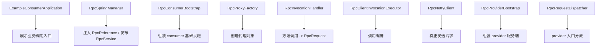

# 关键类源码导读：打开这些类时到底该看什么

## 1. 这一篇和上一篇的区别

上一篇 [01-reading-order.md](D:/aaaRPC/my-rpc-framework/doc/03-source-reading/01-reading-order.md) 解决的是：

`第一遍看源码时，按什么顺序最不容易乱。`

这一篇继续往前走一步，解决的是：

`当我真的打开这些关键类时，应该具体抓住哪些代码、哪些职责、哪些理解点。`

换句话说：

- 上一篇给你“路线图”
- 这一篇给你“站点讲解”

这篇的目标不是替你把所有源码逐行读完，而是帮你建立一个非常实用的阅读习惯：

`每打开一个关键类，先问它在主链路里负责什么，再看它最关键的 1 到 3 段代码。`

如果你能形成这个习惯，框架源码会顺很多。

---

## 2. 打开关键类时统一用这 4 个问题来读

后面每个类，你都可以先按同一套问题去读。

### 问题 1：这个类在整条主链路里的位置是什么

它属于：

- consumer 入口
- 调用编排
- transport
- provider 入口
- 本地执行
- Spring 集成

先给类定位，比先看代码更重要。

### 问题 2：这个类最关键的方法是哪一个

不是所有方法都同等重要。

第一遍只抓最关键的入口方法。

### 问题 3：这个类解决的核心问题是什么

比如：

- 代理创建
- 请求构造
- 地址解析
- 消息分流
- 服务注册

### 问题 4：它会把你带向下一个哪个类

这样你永远不会在单个类里“看到一半不知道往哪走”。

后面每个类，我都按这 4 个问题来带你读。

---

## 3. `ExampleConsumerApplication`：主线从哪里开始

源码位置：
- `example-consumer/src/main/java/com/rpc/ExampleConsumerApplication.java`

先看关键代码：

```java
@Component
static class ConsumerRunner implements ApplicationRunner {
    @RpcReference
    private HelloService helloService;

    @Override
    public void run(ApplicationArguments args) {
        System.out.println(helloService.sayHello("consumer"));
        System.out.println("1 + 2 = " + helloService.add(1, 2));
    }
}
```

### 3.1 它在主链路中的位置

这是业务入口。

也就是：

`整条链最外层、最贴近业务开发者的一层。`

### 3.2 打开它时最该看什么

只看三件事：

1. `@RpcReference`
2. `HelloService`
3. `helloService.sayHello(...)`

### 3.3 它解决的核心问题是什么

它不解决框架内部问题，它只负责向你展示：

`这个项目最终想让业务层以什么体验来使用 RPC。`

也就是：

- 写接口
- 注入接口
- 像本地调用一样去调用它

### 3.4 看完以后你应该继续问什么

1. `@RpcReference` 到底是谁处理的？
2. 这里注入进去的对象到底是什么？

所以这个类会自然把你带向：

- `RpcSpringManager`
- `HelloService`

---

## 4. `HelloService`：为什么接口一定要单独看

源码位置：
- `example-api/src/main/java/com/rpc/HelloService.java`

关键代码：

```java
public interface HelloService {
    String sayHello(String name);

    String sayHi(String name);

    Integer add(Integer a, Integer b);
}
```

### 4.1 它在主链路中的位置

它不属于某一条执行链，而是整条链共享的“服务契约层”。

### 4.2 打开它时最该看什么

不是方法实现，因为接口没有实现。

而是看：

- consumer 和 provider 共享的边界是什么
- 服务名未来会如何映射到接口全限定名
- 方法名、参数类型、返回值类型为什么会在 `RpcRequest` 里出现

### 4.3 它解决的核心问题是什么

它定义了双方共同认可的服务契约。

这也是为什么 consumer 不需要依赖 provider 实现类。

### 4.4 看完以后应该继续去哪

你要去看 provider 对这个契约的实现：

- `HelloServiceImpl`

也要去看 consumer 如何围绕这个契约生成请求：

- `RpcInvocationHandler`

---

## 5. `HelloServiceImpl`：为什么先看终点很重要

源码位置：
- `example-provider/src/main/java/com/rpc/HelloServiceImpl.java`

关键代码：

```java
@RpcService(HelloService.class)
public class HelloServiceImpl implements HelloService {
    @Override
    public String sayHello(String name) {
        return "Hello, " + name + "!";
    }

    @Override
    public Integer add(Integer a, Integer b) {
        return a + b;
    }
}
```

### 5.1 它在主链路中的位置

它是 provider 侧业务执行的最终落点之一。

### 5.2 打开它时最该看什么

只看两件事：

1. `@RpcService(HelloService.class)`
2. 普通业务方法实现

### 5.3 它解决的核心问题是什么

它本身不负责框架流程，它负责告诉你：

`远程请求最终会被还原成怎样的本地业务代码执行。`

### 5.4 为什么第一遍就要看它

因为如果你不知道整条链最后落在哪里，前面很多类会显得像在空中飘。

看了它以后，你会知道：

- 前面的所有复杂度
- 最终都只是为了把调用搬运到这里

这会让你的阅读更稳。

---

## 6. `RpcSpringManager`：打开它时不要先被接口列表吓到

源码位置：
- `rpc-spring/src/main/java/com/rpc/spring/RpcSpringManager.java`

关键代码一：consumer 注入

```java
@Override
public Object postProcessBeforeInitialization(Object bean, String beanName) throws BeansException {
    ReflectionUtils.doWithFields(bean.getClass(), field -> injectReference(bean, field), this::isRpcReferenceField);
    return bean;
}
```

```java
private void injectReference(Object bean, Field field) {
    RpcReference rpcReference = field.getAnnotation(RpcReference.class);
    Class<?> serviceType = rpcReference.value() == Void.class ? field.getType() : rpcReference.value();
    Object proxy = getConsumerBootstrap().getService(serviceType);
    ReflectionUtils.makeAccessible(field);
    ReflectionUtils.setField(field, bean, proxy);
}
```

关键代码二：provider 发布

```java
@Override
public void start() {
    String[] serviceBeanNames = applicationContext.getBeanNamesForAnnotation(RpcService.class);
    if (serviceBeanNames.length > 0) {
        RpcProviderBootstrap bootstrap = getProviderBootstrap();
        for (String beanName : serviceBeanNames) {
            Object bean = applicationContext.getBean(beanName);
            RpcService rpcService = bean.getClass().getAnnotation(RpcService.class);
            bootstrap.registerService(resolveServiceInterface(bean.getClass(), rpcService), bean);
        }
        bootstrap.start();
    }
}
```

### 6.1 它在主链路中的位置

这是 Spring 集成中枢。

### 6.2 打开它时最该看什么

不要试图一上来吃掉它实现的所有 Spring 接口。

第一遍只看两条动作线：

1. 在 Bean 初始化前注入 `@RpcReference`
2. 在容器启动后发布 `@RpcService`

### 6.3 它解决的核心问题是什么

`把 rpc-core 的能力正确接入 Spring 生命周期。`

### 6.4 最容易忽略的阅读重点

它自己不生产代理，也不直接实现网络通信。

它真正做的是：

- 确定何时注入 consumer 代理
- 确定何时发布 provider 服务
- 决定是否复用容器中已有配置 / bootstrap

### 6.5 它把你带向哪里

- `RpcConsumerBootstrap`
- `RpcProviderBootstrap`

---

## 7. `RpcConsumerBootstrap`：打开它时别被配置字段淹没

源码位置：
- `rpc-core/src/main/java/com/rpc/core/api/bootstrap/RpcConsumerBootstrap.java`

关键代码：

```java
public static RpcConsumerBootstrap fromConfig(RpcFrameworkConfig frameworkConfig) {
    DegradationPolicy degradationPolicy = DegradationPolicyFactory.create(...);
    FilterManager.configure(frameworkConfig);
    FilterRuntimeConfigurator.configureConsumer(frameworkConfig, degradationPolicy);

    ServiceDiscovery serviceDiscovery = ServiceRegistryFactory.createDiscovery(frameworkConfig);
    RpcClientConfig clientConfig = RpcClientConfig.builder()
            .transportType(frameworkConfig.getTransportType())
            .connectTimeout(frameworkConfig.getConnectTimeout())
            .readTimeout(frameworkConfig.getReadTimeout())
            .retryTimes(frameworkConfig.getRetryTimes())
            .clusterStrategy(frameworkConfig.getClusterStrategy())
            .methodConfigs(frameworkConfig.getMethodConfigs())
            .loadBalancer(LoadBalancerFactory.getLoadBalancer(frameworkConfig.getLoadBalancer()))
            .serializerName(frameworkConfig.getSerializer())
            .build();

    RpcTransport rpcTransport = RpcTransportFactory.create(clientConfig, serviceDiscovery);
    return new RpcConsumerBootstrap(serviceDiscovery, rpcTransport);
}
```

```java
public <T> T getService(Class<T> serviceClass) {
    return proxyFactory.createProxyInstance(serviceClass);
}
```

### 7.1 它在主链路中的位置

consumer 侧总装配入口。

### 7.2 打开它时最该看什么

先看“装了哪些东西”，不要先看“每个配置字段什么意思”。

你应该先识别出：

- 配置进入点
- 服务发现创建点
- transport 创建点
- 代理工厂入口

### 7.3 它解决的核心问题是什么

`在 consumer 端，把远程调用所需的核心基础设施先组装起来。`

### 7.4 最容易错过的阅读重点

`getService(...)` 不是“获取实现类”，而是“获取代理对象”。

这件事如果你看漏了，后面很多理解会错位。

### 7.5 它把你带向哪里

- `RpcProxyFactory`
- `RpcFrameworkConfig`
- `RpcClientInvocationExecutor`

---

## 8. `RpcProxyFactory`：打开它时要盯住“代理创建”这一个点

源码位置：
- `rpc-core/src/main/java/com/rpc/core/invoke/proxy/RpcProxyFactory.java`

关键代码：

```java
public <T> T createProxyInstance(Class<T> serviceClass) {
    if (serviceClass.isInterface()) {
        return createProxyBySDKInstance(serviceClass);
    }
    return createProxyByCGLibInstance(serviceClass);
}
```

```java
public <T> T createProxyBySDKInstance(Class<T> serviceClass) {
    return (T) Proxy.newProxyInstance(
            serviceClass.getClassLoader(),
            new Class<?>[]{serviceClass},
            new RpcInvocationHandler(serviceClass, requireClient())
    );
}
```

### 8.1 它在主链路中的位置

consumer 入口层里的“代理生成器”。

### 8.2 打开它时最该看什么

只看这三件事：

1. 为什么接口会走 JDK 动态代理
2. 为什么代理回调的是 `RpcInvocationHandler`
3. 它需要一个已经初始化好的 `RpcTransport`

### 8.3 它解决的核心问题是什么

`把一个服务接口包装成一个可拦截方法调用的代理对象。`

### 8.4 最容易读偏的地方

很多人看到 CGLIB / JDK 代理分支就开始钻技术细节。

第一遍不值得。

第一遍只要抓住：

- 代理对象从这里产生
- 真正处理方法调用的是 handler

### 8.5 它把你带向哪里

- `RpcInvocationHandler`

---

## 9. `RpcInvocationHandler`：这个类要精读

源码位置：
- `rpc-core/src/main/java/com/rpc/core/invoke/proxy/impl/RpcInvocationHandler.java`

关键代码：

```java
@Override
public Object invoke(Object proxy, Method method, Object[] args) throws Throwable {
    if (method.getDeclaringClass() == Object.class) {
        return method.invoke(this, args);
    }

    RpcContext rpcContext = RpcContext.create()
            .setRequestId(UUID.randomUUID().toString());

    try {
        RpcRequest request = RpcRequest.builder()
                .requestId(rpcContext.getRequestId())
                .serviceName(serviceClass.getName())
                .methodName(method.getName())
                .parameterTypes(method.getParameterTypes())
                .parameters(args)
                .returnType(method.getReturnType())
                .build();

        FilterContext context = FilterContext.builder()
                .rpcContext(rpcContext)
                .request(request)
                .serviceClass(serviceClass)
                .build();
        RpcResponse response = (RpcResponse) new DefaultFilterChain(
                FilterManager.getFilters(FilterPhase.CONSUMER),
                filterContext -> client.sendRequest(filterContext.getRequest())
        ).proceed(context);

        if (response.getCode() != null && response.getCode() == 200) {
            return response.getData();
        }
        throw new RuntimeException("RPC invoke failed: " + response.getMessage());
    } finally {
        RpcContext.clear();
    }
}
```

### 9.1 它在主链路中的位置

本地方法调用转换为 RPC 请求的第一现场。

### 9.2 打开它时最该看什么

重点看 4 段：

1. 屏蔽 `Object` 自带方法
2. 创建 `RpcContext`
3. 构造 `RpcRequest`
4. 把请求送入 consumer filter 链并交给 transport

### 9.3 它解决的核心问题是什么

`把一次普通 Java 方法调用翻译成一份可远程传输的 RpcRequest。`

### 9.4 为什么这个类要精读

因为这是“概念变数据”的地方。

前面你一直在说“框架会把方法调用转成请求”，真正的落地代码就在这里。

### 9.5 它把你带向哪里

- `RpcClientInvocationExecutor`
- consumer filter 体系

---

## 10. `RpcClientInvocationExecutor`：这是 consumer 侧编排中枢

源码位置：
- `rpc-core/src/main/java/com/rpc/core/transport/netty/client/invocation/RpcClientInvocationExecutor.java`

关键代码：

```java
public RpcResponse execute(RpcRequest rpcRequest, RpcTransportInvoker transportInvoker) throws Exception {
    InvocationOptions options = invocationOptionsResolver.resolve(rpcRequest);
    String rateLimitKey = resolveRateLimitKey(rpcRequest, options);
    if (rateLimiterManager != null
            && options.isRateLimitEnabled()
            && !rateLimiterManager.tryAcquire(rateLimitKey, options.getRateLimitPermitsPerSecond())) {
        return RpcResponse.fail(...);
    }
    applyInvocationOptions(rpcRequest, options);
    FilterContext context = FilterContext.builder()
            .request(rpcRequest)
            .invocationOptions(options)
            .build();

    return (RpcResponse) new DefaultFilterChain(
            FilterManager.getFilters(FilterPhase.INVOKER),
            filterContext -> invokeWithCluster(filterContext.getRequest(), transportInvoker, options)
    ).proceed(context);
}
```

```java
private RpcResponse invokeWithCluster(RpcRequest rpcRequest,
                                      RpcTransportInvoker transportInvoker,
                                      InvocationOptions options) throws Exception {
    ClusterInvoker clusterInvoker = ClusterInvokerFactory.create(
            options.getClusterStrategy(),
            retryExecutor,
            invokeOnce(rpcRequest, transportInvoker, options),
            options.getRetryTimes()
    );
    return clusterInvoker.invoke(rpcRequest, transportInvoker);
}
```

### 10.1 它在主链路中的位置

consumer 侧调用编排中心。

### 10.2 打开它时最该看什么

优先看这几层顺序：

1. 解析方法级配置
2. 调用限流
3. 调用 invoker 过滤器链
4. 进入集群策略
5. 解析地址并真正发送

### 10.3 它解决的核心问题是什么

`把一次请求组织成一套真正可执行的远程调用流程。`

### 10.4 最容易混淆的点

它不是 transport，也不是代理。

- 代理负责接住入口
- transport 负责真正发请求
- 它负责在两者之间做“调用编排”

### 10.5 它把你带向哪里

- `RpcNettyClient`
- `RetryExecutor`
- `LoadBalancerFactory`
- `ServiceResolver`

---

## 11. `RpcNettyClient`：这里不要只看 Netty 语法

源码位置：
- `rpc-core/src/main/java/com/rpc/core/transport/netty/client/RpcNettyClient.java`

关键代码一：统一入口

```java
@Override
public RpcResponse sendRequest(RpcRequest rpcRequest) throws Exception {
    return invocationExecutor.execute(rpcRequest, this::sendRequestToAddress);
}
```

关键代码二：发送到目标地址

```java
private RpcResponse sendRequestToAddress(RpcRequest rpcRequest, InetSocketAddress address) throws Exception {
    long requestId = generateRequestId();
    rpcRequest.setRequestId(String.valueOf(requestId));
    CompletableFuture<RpcResponse> future = requestManager.addRequest(requestId);

    RpcConnection connection = connectionPool.getConnection(address.getHostString(), address.getPort());
    RpcMessage message = buildRequestMessage(rpcRequest, requestId);

    connection.getChannel().writeAndFlush(message).sync();
    return future.get(resolveReadTimeout(rpcRequest), TimeUnit.MILLISECONDS);
}
```

关键代码三：构造协议消息

```java
private RpcMessage buildRequestMessage(RpcRequest rpcRequest, long requestId) {
    byte requestSerializerType = resolveSerializerType(rpcRequest);
    RpcHeader header = RpcHeader.builder()
            .magicNumber(RpcHeader.MAGIC_NUMBER)
            .version(RpcHeader.VERSION)
            .serializerType(requestSerializerType)
            .messageType(RpcMessageType.REQUEST.getCode())
            .requestId(requestId)
            .build();

    RpcMessage message = new RpcMessage();
    message.setHeader(header);
    message.setBody(rpcRequest);
    return message;
}
```

### 11.1 它在主链路中的位置

transport 层核心发送实现。

### 11.2 打开它时最该看什么

不要一上来被 Netty API 细节拖住。

先只看这几个问题：

1. 请求是什么时候真正被转成 `RpcMessage` 的
2. `requestId` 和 future 是怎么关联起来的
3. 为什么同步接口外观底层仍是异步响应匹配
4. pipeline 里挂了哪些关键处理器

### 11.3 它解决的核心问题是什么

`把已经组织好的 RpcRequest 真正通过网络发出去，并把响应接回来。`

### 11.4 最值得记住的一点

它负责的是“怎么发”，不是“这次应该怎么调”。

这和 `RpcClientInvocationExecutor` 的职责是分开的。

### 11.5 它把你带向哪里

- `RpcProtocolEncoder`
- `RpcProtocolDecoder`
- provider 入口侧类

---

## 12. `RpcProviderBootstrap`：看它时重点看“服务是怎么暴露的”

源码位置：
- `rpc-core/src/main/java/com/rpc/core/api/bootstrap/RpcProviderBootstrap.java`

关键代码：

```java
public RpcProviderBootstrap registerService(Class<?> serviceInterface, Object serviceImpl) {
    rpcServer.getLocalRegistry().register(serviceInterface.getName(), serviceImpl);
    return this;
}
```

```java
public void start() throws Exception {
    if (frameworkConfig.isServerAutoRegisterAnnotatedServices() && !configuredServicesRegistered) {
        registerConfiguredServices();
    }
    rpcServer.start();
}
```

### 12.1 它在主链路中的位置

provider 侧总装配入口。

### 12.2 打开它时最该看什么

第一遍就看两条主线：

1. 服务怎么被注册到本地注册表
2. 服务端网络什么时候真正开始监听

### 12.3 它解决的核心问题是什么

`把 provider 端的服务对象和服务端基础设施组织起来。`

### 12.4 为什么这个类比你想的更重要

很多人会觉得 provider 端最重要的是业务实现类。

但如果没有 `RpcProviderBootstrap`，服务对象根本不会被正确挂到 RPC 服务端体系里。

### 12.5 它把你带向哪里

- `RpcRequestDispatcher`
- `LocalRegistry`

---

## 13. `RpcRequestDispatcher`：provider 入口先做的是分流，不是执行业务

源码位置：
- `rpc-core/src/main/java/com/rpc/core/transport/netty/server/dispatch/RpcRequestDispatcher.java`

关键代码：

```java
@Override
public RpcMessage process(RpcMessage message) {
    RpcHeader header = message.getHeader();
    RpcMessageType messageType = RpcMessageType.fromCode(header.getMessageType());

    return switch (messageType) {
        case HEARTBEAT_REQUEST -> handleHeartbeatRequest(message);
        case REQUEST -> handleBusinessRequest(message);
        default -> null;
    };
}
```

```java
private RpcMessage handleBusinessRequest(RpcMessage requestMessage) {
    RpcHeader requestHeader = requestMessage.getHeader();
    RpcRequest rpcRequest = (RpcRequest) requestMessage.getBody();

    RpcResponse rpcResponse;
    if (!serverLifecycle.isAcceptingRequests()) {
        rpcResponse = RpcResponse.fail(503, "Server is shutting down", rpcRequest.getRequestId());
    } else {
        rpcResponse = requestExecutor.execute(rpcRequest);
    }
    return buildResponseMessage(rpcResponse, requestHeader);
}
```

### 13.1 它在主链路中的位置

provider 消息入口分流器。

### 13.2 打开它时最该看什么

先看两条分支：

1. 心跳请求怎么处理
2. 业务请求怎么转交给执行器

### 13.3 它解决的核心问题是什么

`在 provider 收到消息之后，先判断这到底是什么类型的消息，再决定走哪条处理链。`

### 13.4 最容易看漏的点

它不是业务执行器。

它负责的是“入口分流”，不是“最终执行业务方法”。

### 13.5 它把你带向哪里

- `RpcRequestExecutor`
- `RpcHeader`
- `RpcResponse`

---

## 14. 一张“关键类作用图”



如果你每看完一个类，都能把它放到这张图里，你的阅读会很稳。

---

## 15. 读这些类时，哪些东西第一遍可以先跳过

为了避免阅读压力过大，下面这些内容第一遍都可以只做到“知道存在”，不用强求完全吃透：

1. 每个过滤器实现细节
2. 每个 SPI 扩展实现细节
3. 每个 Netty handler 的完整源码
4. 每个配置项的边界情况
5. 每个异常分支和日志分支
6. 每个工具类和辅助方法

为什么？

因为这些东西的理解前提，是你已经知道自己处在主链路的哪一段。

所以先抓主流程，再补细节，收益最高。

---

## 16. 读完这一篇后，你应该达到的状态

到这里，你应该能做到下面这些事：

1. 打开关键类时，不再只是“从上往下看代码”
2. 能先说出这个类在主链路中的位置
3. 能抓住这个类最关键的 1 到 3 段代码
4. 能知道它解决的核心问题
5. 能知道它应该把你带向下一个哪个类

如果你已经能这样读源码，说明你已经从“被代码拖着走”切换到“带着问题读代码”的状态了。

---

## 17. 下一篇看什么

下一篇是 [03-glossary-and-class-map.md](D:/aaaRPC/my-rpc-framework/doc/03-source-reading/03-glossary-and-class-map.md)。

这一篇会把阅读过程中最容易混的术语和类关系彻底摊开，让你之后看源码时不再反复卡在词义上。

---

## 18. 本篇源码定位

建议重点打开这些文件对照阅读：

- `example-consumer/src/main/java/com/rpc/ExampleConsumerApplication.java`
- `example-api/src/main/java/com/rpc/HelloService.java`
- `example-provider/src/main/java/com/rpc/HelloServiceImpl.java`
- `rpc-spring/src/main/java/com/rpc/spring/RpcSpringManager.java`
- `rpc-core/src/main/java/com/rpc/core/api/bootstrap/RpcConsumerBootstrap.java`
- `rpc-core/src/main/java/com/rpc/core/invoke/proxy/RpcProxyFactory.java`
- `rpc-core/src/main/java/com/rpc/core/invoke/proxy/impl/RpcInvocationHandler.java`
- `rpc-core/src/main/java/com/rpc/core/transport/netty/client/invocation/RpcClientInvocationExecutor.java`
- `rpc-core/src/main/java/com/rpc/core/transport/netty/client/RpcNettyClient.java`
- `rpc-core/src/main/java/com/rpc/core/api/bootstrap/RpcProviderBootstrap.java`
- `rpc-core/src/main/java/com/rpc/core/transport/netty/server/dispatch/RpcRequestDispatcher.java`
