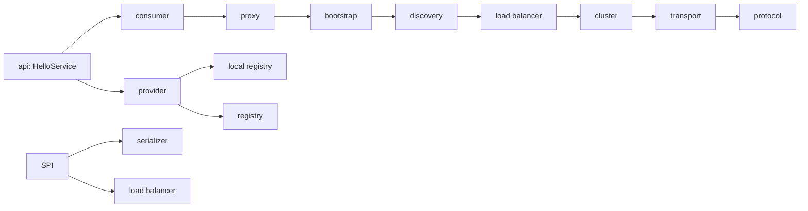

# 术语表与类关系图：把词和源码真正对上

## 1. 为什么很多人不是看不懂代码，而是先被术语绊住

框架项目里最容易让人累的，常常不是某一行代码太难，而是同时出现很多词：

- consumer
- provider
- api
- proxy
- bootstrap
- registry
- discovery
- local registry
- protocol
- transport
- filter
- cluster
- SPI
- serializer
- load balancer

如果这些词只是“听说过”，但没有稳定落到具体类上，那么你每次看源码都会反复卡住：

1. 这个词在这个项目里具体对应谁？
2. 它和另一个相近术语有什么区别？
3. 这个类到底属于哪一层？
4. 当前这段代码是在处理哪一种角色？

所以这篇文档不只是名词解释，而是要做一件更实用的事：

`把术语、职责和源码里的真实类一一对上。`

这样你以后在 IDE 里看到一个词，脑子里会立刻跳出对应的角色和类，而不是只剩抽象印象。

---

## 2. 先给出一张总图

```mermaid
graph TD
    A["api"] --> B["HelloService"]
    C["consumer"] --> D["ExampleConsumerApplication"]
    C --> E["RpcSpringManager"]
    C --> F["RpcConsumerBootstrap"]
    C --> G["RpcProxyFactory"]
    C --> H["RpcInvocationHandler"]
    C --> I["RpcClientInvocationExecutor"]
    C --> J["RpcNettyClient"]
    K["provider"] --> L["HelloServiceImpl"]
    K --> M["RpcProviderBootstrap"]
    K --> N["RpcRequestDispatcher"]
    O["protocol"] --> P["RpcHeader"]
    O --> Q["RpcProtocolEncoder"]
    O --> R["RpcProtocolDecoder"]
    S["extension / SPI"] --> T["ExtensionFactory"]
    S --> U["LoadBalancerFactory"]
    S --> V["SerializerFactory"]
```



这张图的作用不是一次记住全部，而是给你一个总的参照系。

后面每个术语都只是这张图里某个点的展开。

---

## 3. `consumer`：在这个项目里到底是谁

最朴素的定义：

`发起远程调用的一方。`

在当前项目里，consumer 不是一个类，而是一组角色和类。

最直接的对应包括：

- `example-consumer`
- `ExampleConsumerApplication`
- `RpcSpringManager` 中 consumer 注入部分
- `RpcConsumerBootstrap`
- `RpcProxyFactory`
- `RpcInvocationHandler`
- `RpcClientInvocationExecutor`
- `RpcNettyClient`

你可以把 consumer 理解成两个层面。

### 3.1 业务层面的 consumer

就是业务代码写：

```java
helloService.sayHello("consumer")
```

### 3.2 框架层面的 consumer

是那一整套帮你把这句调用翻译成远程请求的组件群。

这两个层面不要混。业务层看到的是“接口调用”，框架层做的是“远程调用编排”。

---

## 4. `provider`：在这个项目里到底是谁

最朴素的定义：

`真正提供远程服务的一方。`

在当前项目里，它同样不是单个类，而是一组角色：

- `example-provider`
- `HelloServiceImpl`
- `RpcSpringManager` 中 provider 发布部分
- `RpcProviderBootstrap`
- `RpcRequestDispatcher`
- 更下游的本地执行器和本地注册表

provider 端最容易被误解的一点是：

很多人会以为 provider 就是业务实现类。

其实不够准确。

更准确的说法是：

- `HelloServiceImpl` 是 provider 的业务实现
- `RpcProviderBootstrap` / `RpcRequestDispatcher` / 本地注册表等，是 provider 的服务端基础设施

只有这两部分一起存在，provider 才算完整。

---

## 5. `api`：为什么它要单独一个模块

最朴素的定义：

`consumer 和 provider 共同依赖的契约层。`

在当前项目里最典型的对应就是：

- `example-api`
- `HelloService`

它的意义非常大。

因为如果没有这个契约层，就会出现两个问题：

1. consumer 不知道该调用什么接口
2. provider 和 consumer 对服务定义没有统一标准

所以 `api` 模块不是“放几个接口的边角模块”，而是整个 RPC 调用关系成立的前提。

---

## 6. `proxy`：这个词在项目里具体落到谁

最朴素的定义：

`看起来像本地对象，实际上负责接管方法调用的对象。`

在当前项目里，它主要对应：

- `RpcProxyFactory`
- `RpcInvocationHandler`

两者分工要分清：

### `RpcProxyFactory`

负责：

- 创建代理对象
- 决定接口走 JDK 动态代理，类走 CGLIB

### `RpcInvocationHandler`

负责：

- 真正接住方法调用
- 构造 `RpcRequest`
- 把调用交给后续链路

很多人会把“代理创建”和“代理接管逻辑”混成一件事。

在这个项目里，它们是拆开的。

这是很合理的：

- 工厂负责造对象
- handler 负责处理调用

---

## 7. `bootstrap`：为什么这个词反复出现

最朴素的定义：

`启动和组装入口。`

在当前项目里主要对应：

- `RpcConsumerBootstrap`
- `RpcProviderBootstrap`

你可以简单把 `bootstrap` 理解成“总装配器”。

### `RpcConsumerBootstrap` 做什么

- 读取配置
- 组装服务发现
- 组装 transport
- 组装代理能力

### `RpcProviderBootstrap` 做什么

- 读取配置
- 组装服务端能力
- 注册本地服务
- 启动 RPC server

所以 `bootstrap` 不是业务类，也不是单个功能类，而是“把多个零件接成一整套可运行系统”的入口。

---

## 8. `registry` 和 `discovery`：最容易混的一组词

这是新手最容易混的一组。

### 8.1 `registry`

最朴素的定义：

`和注册中心交互，维护服务地址注册信息的能力。`

在当前项目里主要对应：

- `ServiceRegistry`
- `ServiceRegistryFactory`
- 具体注册中心实现类

它更偏向 provider 侧“把自己注册出去”，以及系统层面“如何维护服务地址”。

### 8.2 `discovery`

最朴素的定义：

`让 consumer 拿到可用 provider 地址的能力。`

在当前项目里主要对应：

- `ServiceDiscovery`
- `ServiceDirectory`
- `RpcServiceResolver`

它更偏向 consumer 侧“我现在要调用某个服务，该找谁”。

一句话区分：

- `registry` 更偏“服务怎么注册和存储”
- `discovery` 更偏“consumer 怎么拿到地址并使用它”

---

## 9. `local registry`：为什么它和注册中心不是一回事

最朴素的定义：

`provider 本地 JVM 内部保存“服务名 -> 服务对象”映射的地方。`

对应类：

- `LocalRegistry`
- `LocalRegistryImpl`
- `RpcProviderBootstrap.registerService(...)` 相关逻辑

它和注册中心的区别一定要记住。

### 注册中心解决什么

consumer 去哪里找到 provider 地址。

### 本地注册表解决什么

provider 已经收到请求之后，本地到底调用哪个对象。

比如：

```text
com.rpc.HelloService -> HelloServiceImpl 实例
```

这件事根本不该由远端注册中心来管，而应该由 provider 本地自己管理。

所以：

- 注册中心是远程寻址
- 本地注册表是本地分发

这是两个完全不同层次的问题。

---

## 10. `protocol`：这个词到底对应哪些类

最朴素的定义：

`通信双方共同遵守的消息格式。`

在当前项目里最直接对应：

- `RpcHeader`
- `RpcMessage`
- `RpcMessageType`
- `RpcProtocolEncoder`
- `RpcProtocolDecoder`

你可以把协议层看成：

`规定消息长什么样。`

它关心的是：

- 头里有哪些字段
- 如何区分请求/响应/心跳
- 用哪种序列化器
- 如何把对象编码成字节
- 如何从字节还原成对象

所以协议层不负责“怎么连网”，它只负责“消息格式”。

---

## 11. `transport`：它和 `protocol` 的边界到底在哪

最朴素的定义：

`把消息真正发出去、收回来的一层。`

在当前项目里主要对应：

- `RpcTransport`
- `RpcNettyClient`
- `RpcServer`
- 连接池、请求管理器、Netty handler 等

一句话区分：

- `protocol`：消息长什么样
- `transport`：消息怎么走网络

你如果把这两者混了，就会在 `RpcNettyClient`、`RpcProtocolEncoder`、`RpcProtocolDecoder` 这些类之间反复卡住。

所以建议一直带着下面这句话读源码：

`协议定义格式，传输负责通道。`

---

## 12. `filter`：它在这个项目里不是附加品，而是插入点

最朴素的定义：

`在主流程关键位置插入横切逻辑的机制。`

对应类通常包括：

- `FilterManager`
- `DefaultFilterChain`
- `FilterPhase`
- 各类具体 filter

这个项目里常见的 filter 阶段包括：

- `CONSUMER`
- `INVOKER`
- `PROVIDER`

你可以把它们理解成：

- consumer 入口附近插一层
- 真正调用编排附近再插一层
- provider 执行链附近再插一层

为什么要这么做？

因为日志、统计、限流、熔断、降级这类逻辑往往是横切关注点，不适合硬塞进每个主流程类里。

所以 filter 是“为横切逻辑预留的标准插入点”。

---

## 13. `cluster`：这个词在当前项目里到底指什么

最朴素的定义：

`当服务有多个实例时，这次调用按什么容错策略执行。`

对应内容通常包括：

- `ClusterStrategy`
- `ClusterInvoker`
- `ClusterInvokerFactory`
- `FAIL_FAST` / `FAIL_OVER` 等策略

很多人第一次看到 `cluster` 会误解成“集群部署”那个大词。

在源码里它更具体，主要是：

`这次调用失败后，是否切到别的实例重试，还是立刻失败。`

它解决的是调用策略问题，而不是部署架构问题。

---

## 14. `SPI`：为什么它不是一个空概念

最朴素的定义：

`让框架按接口 + 名称加载不同实现的一种扩展机制。`

当前项目里，最值得记住的对应类是：

- `ExtensionFactory`
- `ExtensionLoader`
- `LoadBalancerFactory`
- `SerializerFactory`

你在源码里看到 SPI 时，不要只把它理解成“高级扩展机制”。

更直接地理解就够了：

`把“配置里写的名字”，变成“运行时真正使用的实现对象”。`

例如：

- `random` -> 某个负载均衡器实现
- `protobuf` -> 某个序列化器实现

这样框架就不用把这些能力写死。

---

## 15. `serializer`：它在项目里具体落到谁

最朴素的定义：

`负责把对象变成字节，再把字节还原成对象。`

主要对应：

- `Serializer`
- `SerializerFactory`
- 各种具体序列化实现
- `RpcProtocolEncoder`
- `RpcProtocolDecoder`

注意边界：

- `Serializer` 不是协议
- 它只是协议层会使用的一种能力

协议层负责：

- 头字段
- 消息类型
- 格式顺序

序列化器负责：

- body 如何编码和解码

---

## 16. `load balancer`：它在项目里具体落到谁

最朴素的定义：

`在多个可用 provider 地址中，决定这次选哪个地址。`

主要对应：

- `LoadBalancer`
- `LoadBalancerFactory`
- `RpcServiceResolver`
- `RpcClientInvocationExecutor` 里的服务地址解析路径

你在阅读时一定要把它和 `discovery` 区分开：

- discovery：先把可用地址列表拿到
- load balancer：再从列表里选一个

没有 discovery，根本不知道可选项；没有负载均衡，可能每次都不会合理选地址。

---

## 17. 术语和类的一张对照表

下面这张表建议你反复看，直到词和类能快速对上。

| 术语 | 在这个项目里的朴素含义 | 主要对应类 |
| --- | --- | --- |
| consumer | 发起远程调用的一方 | `ExampleConsumerApplication` `RpcConsumerBootstrap` `RpcInvocationHandler` |
| provider | 提供远程服务的一方 | `HelloServiceImpl` `RpcProviderBootstrap` `RpcRequestDispatcher` |
| api | 双方共享契约 | `HelloService` |
| proxy | 代理对象及其调用接管逻辑 | `RpcProxyFactory` `RpcInvocationHandler` |
| bootstrap | 启动与组装入口 | `RpcConsumerBootstrap` `RpcProviderBootstrap` |
| registry | 注册中心交互与地址注册 | `ServiceRegistry` `ServiceRegistryFactory` |
| discovery | consumer 获取服务地址 | `ServiceDiscovery` `ServiceDirectory` `RpcServiceResolver` |
| local registry | provider 本地服务映射 | `LocalRegistry` |
| protocol | 消息格式定义与编解码 | `RpcHeader` `RpcProtocolEncoder` `RpcProtocolDecoder` |
| transport | 网络发送与接收 | `RpcTransport` `RpcNettyClient` |
| filter | 横切逻辑插入点 | `FilterManager` `DefaultFilterChain` |
| cluster | 多实例调用策略 | `ClusterInvoker` `ClusterInvokerFactory` |
| SPI | 按接口和名称加载扩展实现 | `ExtensionFactory` `ExtensionLoader` |
| serializer | 对象和字节转换 | `SerializerFactory` |
| load balancer | 从多个地址中选一个 | `LoadBalancerFactory` `RpcServiceResolver` |

---

## 18. 一张“术语关系图”



这张图的价值在于帮你看见：

- 哪些词是“consumer 主线里的概念”
- 哪些词是“provider 主线里的概念”
- 哪些词是“横跨全链路的基础能力”

---

## 19. 最容易混的 6 组概念，最后再统一压一遍

### 19.1 `registry` 和 `local registry`

- `registry`：远程服务地址注册
- `local registry`：provider 本地服务对象映射

### 19.2 `discovery` 和 `load balancer`

- `discovery`：拿列表
- `load balancer`：从列表里选一个

### 19.3 `protocol` 和 `transport`

- `protocol`：格式
- `transport`：通道

### 19.4 `proxy` 和 `bootstrap`

- `proxy`：接住调用
- `bootstrap`：组装运行环境

### 19.5 `cluster` 和 `retry`

- `cluster`：多实例容错策略
- `retry`：具体一次请求失败后是否重试

### 19.6 `SPI` 和“普通工厂方法”

- 普通工厂：写死创建逻辑
- SPI：按扩展名动态选实现

这 6 组如果你已经能稳定分开，后面看源码会轻松很多。

---

## 20. 这篇结束时，你应该达到的状态

到这里你至少应该做到：

1. 看到一个术语时，能立刻说出它在项目里大致对应哪些类
2. 看到一个关键类时，能大致判断它属于哪一层
3. 不再把 `registry`、`discovery`、`local registry` 混成一件事
4. 不再把 `protocol` 和 `transport` 混成一件事
5. 不再把 `proxy`、`bootstrap`、`SPI` 都只当成抽象名词

如果你已经能做到这些，说明源码阅读时最大的“词汇阻力”已经明显下降了。

---

## 21. 回到整套学习路径，你现在处在什么位置

到目前为止，你已经完成了两件关键事情：

1. 主线课程把项目调用过程讲通了
2. 源码阅读区把阅读顺序、关键类和术语关系讲顺了

这意味着你现在已经从“完全没有项目基础”进入了“可以带着主线去读源码”的状态。

后面如果继续深化，最自然的方向就是：

- 继续补关键类逐行批注
- 深挖 provider 本地执行链
- 深挖协议和 Netty handler 细节
- 深挖 SPI 扩展点具体实现

但这些都建立在你现在已经具备的术语地图之上。

---

## 22. 本篇源码定位

建议配合本文对照这些文件：

- `example-api/src/main/java/com/rpc/HelloService.java`
- `example-consumer/src/main/java/com/rpc/ExampleConsumerApplication.java`
- `example-provider/src/main/java/com/rpc/HelloServiceImpl.java`
- `rpc-spring/src/main/java/com/rpc/spring/RpcSpringManager.java`
- `rpc-core/src/main/java/com/rpc/core/api/bootstrap/RpcConsumerBootstrap.java`
- `rpc-core/src/main/java/com/rpc/core/api/bootstrap/RpcProviderBootstrap.java`
- `rpc-core/src/main/java/com/rpc/core/invoke/proxy/RpcProxyFactory.java`
- `rpc-core/src/main/java/com/rpc/core/invoke/proxy/impl/RpcInvocationHandler.java`
- `rpc-core/src/main/java/com/rpc/core/transport/netty/client/invocation/RpcClientInvocationExecutor.java`
- `rpc-core/src/main/java/com/rpc/core/transport/netty/client/RpcNettyClient.java`
- `rpc-core/src/main/java/com/rpc/core/protocol/message/RpcHeader.java`
- `rpc-core/src/main/java/com/rpc/core/protocol/codec/RpcProtocolEncoder.java`
- `rpc-core/src/main/java/com/rpc/core/protocol/codec/RpcProtocolDecoder.java`
- `rpc-core/src/main/java/com/rpc/core/extension/spi/ExtensionFactory.java`
- `rpc-core/src/main/java/com/rpc/core/extension/loadbalance/factory/LoadBalancerFactory.java`
- `rpc-core/src/main/java/com/rpc/core/extension/serialize/factory/SerializerFactory.java`
